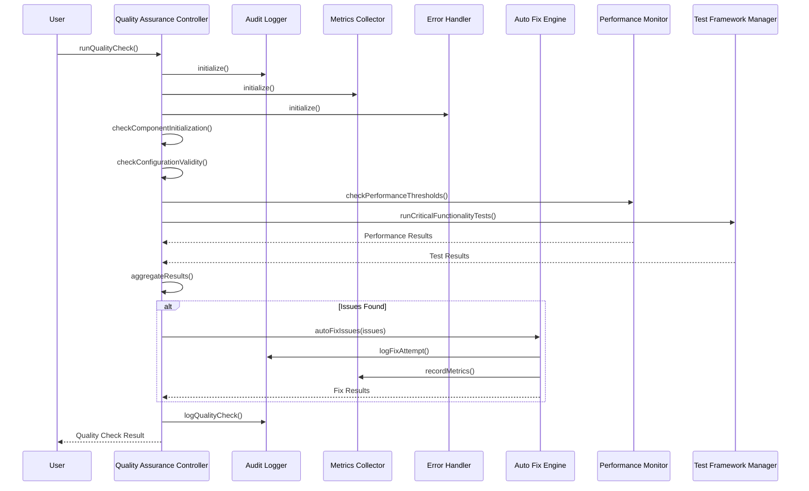
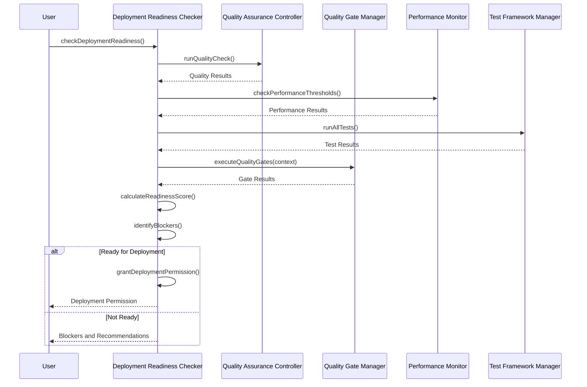
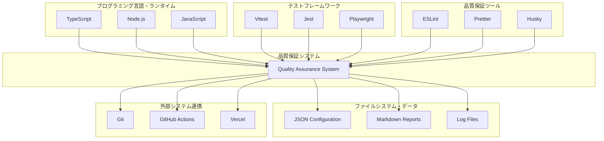
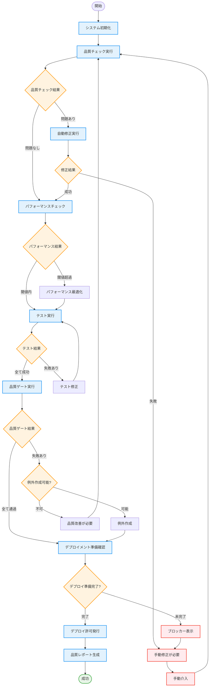
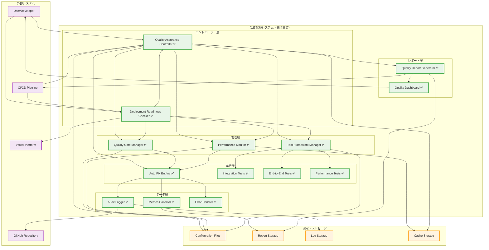

# システム品質保証 アーキテクチャ図

**バージョン:** 1.0  
**最終更新:** 2025-08-29  
**対象:** アーキテクト、開発者、システム管理者

## 概要

このドキュメントは、システム品質保証機能の完全なアーキテクチャを視覚的に表現します。実装完了したすべてのコンポーネントとその相互関係を詳細に示します。

## 全体アーキテクチャ

### システム全体図

```mermaid
graph TB
    subgraph "品質保証システム（実装完了）"
        QAC[Quality Assurance Controller ✅]
        DRC[Deployment Readiness Checker ✅]
        QGM[Quality Gate Manager ✅]
        PM[Performance Monitor ✅]
        TFM[Test Framework Manager ✅]
        QRG[Quality Report Generator ✅]
        QD[Quality Dashboard ✅]
    end
    
    subgraph "コアコンポーネント（修正完了）"
        AL[Audit Logger ✅]
        MC[Metrics Collector ✅]
        EH[Error Handler ✅]
        TDE[Trust Decision Engine]
    end
    
    subgraph "自動修正エンジン（実装完了）"
        AF[Auto Fix Engine ✅]
        DR[Dependency Resolution ✅]
        PTM[Performance Threshold Manager ✅]
        SP[Security Protection ✅]
        PO[Performance Optimizer ✅]
    end
    
    subgraph "テストスイート（実装完了）"
        ITS[Integration Test Suite ✅]
        E2E[End-to-End Test Suite ✅]
        UT[Unit Tests ✅]
        PT[Performance Tests ✅]
        AT[Acceptance Tests ✅]
    end
    
    subgraph "品質ゲート（実装完了）"
        CG[Critical Gate ✅]
        MG[Major Gate ✅]
        MiG[Minor Gate ✅]
        QGE[Quality Gate Exceptions ✅]
    end
    
    subgraph "レポート・監視（実装完了）"
        REP[Quality Reports ✅]
        DASH[Quality Dashboard ✅]
        ALERT[Quality Alerts ✅]
        LOG[Audit Logs ✅]
        METRICS[Performance Metrics ✅]
    end
    
    subgraph "設定・データ"
        CFG[Configuration Files]
        BACKUP[Backup Files]
        CACHE[Cache Storage]
    end
    
    %% 主要な接続
    QAC --> AL
    QAC --> MC
    QAC --> EH
    QAC --> AF
    
    DRC --> QAC
    DRC --> QGM
    DRC --> PM
    DRC --> TFM
    
    QGM --> CG
    QGM --> MG
    QGM --> MiG
    QGM --> QGE
    
    PM --> PTM
    TFM --> DR
    
    AF --> AL
    AF --> MC
    AF --> EH
    AF --> SP
    AF --> PO
    
    ITS --> QAC
    ITS --> DRC
    ITS --> QGM
    
    E2E --> ITS
    E2E --> QAC
    
    AT --> TFM
    PT --> PM
    UT --> TFM
    
    QAC --> QRG
    QRG --> REP
    QD --> DASH
    QGM --> ALERT
    AL --> LOG
    PM --> METRICS
    
    %% 設定・データの接続
    QAC --> CFG
    QGM --> CFG
    PM --> CFG
    TFM --> CFG
    
    CFG --> BACKUP
    QAC --> CACHE
    PM --> CACHE
    
    %% スタイル設定
    classDef implemented fill:#e8f5e8,stroke:#4caf50,stroke-width:2px
    classDef core fill:#fff3e0,stroke:#ff9800,stroke-width:2px
    classDef config fill:#f3e5f5,stroke:#9c27b0,stroke-width:2px
    
    class QAC,DRC,QGM,PM,TFM,QRG,QD,AF,DR,PTM,SP,PO,ITS,E2E,UT,PT,AT,CG,MG,MiG,QGE,REP,DASH,ALERT,LOG,METRICS implemented
    class AL,MC,EH,TDE core
    class CFG,BACKUP,CACHE config
```



## コンポーネント詳細図

### 品質保証コントローラー

```mermaid
graph TB
    subgraph "Quality Assurance Controller"
        QAC_INIT[initialize()]
        QAC_CHECK[runQualityCheck()]
        QAC_FIX[autoFixIssues()]
        QAC_REPORT[generateQualityReport()]
        QAC_HEALTH[runBasicHealthCheck()]
    end
    
    subgraph "品質チェック機能"
        CHECK_INIT[checkComponentInitialization()]
        CHECK_CONFIG[checkConfigurationValidity()]
        CHECK_PERF[checkPerformanceDegradation()]
        CHECK_TEST[checkTestCoverage()]
        CHECK_API[checkAPIMismatch()]
    end
    
    subgraph "自動修正機能"
        FIX_MISSING[fixMissingMethods()]
        FIX_CONFIG[fixInvalidConfig()]
        FIX_PERF[fixPerformanceIssues()]
        FIX_INIT[fixInitializationErrors()]
    end
    
    subgraph "外部コンポーネント"
        AL_EXT[Audit Logger]
        MC_EXT[Metrics Collector]
        EH_EXT[Error Handler]
        AF_EXT[Auto Fix Engine]
    end
    
    QAC_CHECK --> CHECK_INIT
    QAC_CHECK --> CHECK_CONFIG
    QAC_CHECK --> CHECK_PERF
    QAC_CHECK --> CHECK_TEST
    QAC_CHECK --> CHECK_API
    
    QAC_FIX --> FIX_MISSING
    QAC_FIX --> FIX_CONFIG
    QAC_FIX --> FIX_PERF
    QAC_FIX --> FIX_INIT
    
    QAC_INIT --> AL_EXT
    QAC_INIT --> MC_EXT
    QAC_INIT --> EH_EXT
    QAC_FIX --> AF_EXT
```

### デプロイメント準備確認システム

```mermaid
graph TB
    subgraph "Deployment Readiness Checker"
        DRC_INIT[initialize()]
        DRC_CHECK[checkDeploymentReadiness()]
        DRC_GRANT[grantDeploymentPermission()]
        DRC_VERIFY[runPostDeploymentVerification()]
    end
    
    subgraph "準備確認プロセス"
        QUALITY_CHECK[Quality Check]
        PERF_CHECK[Performance Check]
        TEST_CHECK[Test Results Check]
        GATE_CHECK[Quality Gates Check]
        BLOCKER_CHECK[Blocker Detection]
    end
    
    subgraph "デプロイメント判定"
        SCORE_CALC[Score Calculation]
        READY_EVAL[Readiness Evaluation]
        PERMISSION[Permission Grant]
        CONDITIONS[Condition Validation]
    end
    
    subgraph "外部システム"
        QAC_EXT[Quality Assurance Controller]
        QGM_EXT[Quality Gate Manager]
        PM_EXT[Performance Monitor]
        TFM_EXT[Test Framework Manager]
    end
    
    DRC_CHECK --> QUALITY_CHECK
    DRC_CHECK --> PERF_CHECK
    DRC_CHECK --> TEST_CHECK
    DRC_CHECK --> GATE_CHECK
    DRC_CHECK --> BLOCKER_CHECK
    
    QUALITY_CHECK --> SCORE_CALC
    PERF_CHECK --> SCORE_CALC
    TEST_CHECK --> SCORE_CALC
    GATE_CHECK --> SCORE_CALC
    
    SCORE_CALC --> READY_EVAL
    READY_EVAL --> PERMISSION
    PERMISSION --> CONDITIONS
    
    DRC_CHECK --> QAC_EXT
    DRC_CHECK --> QGM_EXT
    DRC_CHECK --> PM_EXT
    DRC_CHECK --> TFM_EXT
```

### 品質ゲート管理システム

```mermaid
graph TB
    subgraph "Quality Gate Manager"
        QGM_INIT[initialize()]
        QGM_EXEC[executeQualityGates()]
        QGM_EXCEPT[createException()]
        QGM_ADJUST[adjustQualityThresholds()]
    end
    
    subgraph "品質ゲート実行"
        GATE_LOAD[Load Gate Configuration]
        GATE_VALIDATE[Validate Context]
        GATE_EXECUTE[Execute Gates]
        GATE_EVALUATE[Evaluate Results]
    end
    
    subgraph "品質ゲート種別"
        CRITICAL_GATE[Critical Gate]
        MAJOR_GATE[Major Gate]
        MINOR_GATE[Minor Gate]
    end
    
    subgraph "例外管理"
        EXCEPT_CREATE[Create Exception]
        EXCEPT_VALIDATE[Validate Exception]
        EXCEPT_APPLY[Apply Exception]
        EXCEPT_EXPIRE[Handle Expiration]
    end
    
    subgraph "閾値管理"
        THRESHOLD_LOAD[Load Thresholds]
        THRESHOLD_ADJUST[Adjust Dynamically]
        THRESHOLD_SAVE[Save Changes]
    end
    
    QGM_EXEC --> GATE_LOAD
    GATE_LOAD --> GATE_VALIDATE
    GATE_VALIDATE --> GATE_EXECUTE
    GATE_EXECUTE --> GATE_EVALUATE
    
    GATE_EXECUTE --> CRITICAL_GATE
    GATE_EXECUTE --> MAJOR_GATE
    GATE_EXECUTE --> MINOR_GATE
    
    QGM_EXCEPT --> EXCEPT_CREATE
    EXCEPT_CREATE --> EXCEPT_VALIDATE
    EXCEPT_VALIDATE --> EXCEPT_APPLY
    EXCEPT_APPLY --> EXCEPT_EXPIRE
    
    QGM_ADJUST --> THRESHOLD_LOAD
    THRESHOLD_LOAD --> THRESHOLD_ADJUST
    THRESHOLD_ADJUST --> THRESHOLD_SAVE
```

## データフロー図

### 品質チェックフロー



### デプロイメント準備確認フロー



## 技術スタック図

### 実装技術スタック



## 配置図

### ファイル・ディレクトリ構造

```mermaid
graph TB
    subgraph "プロジェクトルート"
        ROOT[/]
    end
    
    subgraph ".kiro/ (品質保証システム)"
        KIRO[.kiro/]
        
        subgraph "lib/trust-policy/ (コアライブラリ)"
            LIB[lib/trust-policy/]
            QAC_FILE[quality-assurance-controller.ts ✅]
            DRC_FILE[deployment-readiness-checker.ts ✅]
            QGM_FILE[quality-gate-manager.ts ✅]
            PM_FILE[performance-monitor.ts ✅]
            TFM_FILE[test-framework-manager.ts ✅]
            AL_FILE[audit-logger.ts ✅]
            MC_FILE[metrics-collector.ts ✅]
            EH_FILE[error-handler.ts ✅]
        end
        
        subgraph "settings/ (設定ファイル)"
            SETTINGS[settings/]
            TRUST_POLICY[trust-policy.json]
            QUALITY_GATES[quality-gates.json]
            PERF_THRESHOLDS[performance-thresholds.json]
        end
        
        subgraph "scripts/ (実行スクリプト)"
            SCRIPTS[scripts/]
            INIT_SCRIPT[init-trust-policy.mjs]
            QUALITY_SCRIPT[run-quality-check.mjs]
            TEST_SCRIPTS[test-*.mjs]
        end
        
        subgraph "reports/ (レポート)"
            REPORTS[reports/]
            QUALITY_REPORTS[quality-*.md]
            AUDIT_LOGS[audit-*.md]
            METRICS[metrics-*.json]
        end
        
        subgraph "backups/ (バックアップ)"
            BACKUPS[backups/]
            CONFIG_BACKUPS[*.backup.json]
        end
        
        subgraph "docs/ (ドキュメント)"
            DOCS[docs/]
            API_SPEC[API_SPECIFICATION.md ✅]
            SYSTEM_GUIDE[SYSTEM_QUALITY_ASSURANCE_GUIDE.md ✅]
            DEV_GUIDE[DEVELOPER_GUIDE.md ✅]
            CONFIG_GUIDE[CONFIGURATION_GUIDE.md ✅]
            ARCH_DIAGRAM[ARCHITECTURE_DIAGRAM.md ✅]
        end
    end
    
    ROOT --> KIRO
    KIRO --> LIB
    KIRO --> SETTINGS
    KIRO --> SCRIPTS
    KIRO --> REPORTS
    KIRO --> BACKUPS
    KIRO --> DOCS
    
    LIB --> QAC_FILE
    LIB --> DRC_FILE
    LIB --> QGM_FILE
    LIB --> PM_FILE
    LIB --> TFM_FILE
    LIB --> AL_FILE
    LIB --> MC_FILE
    LIB --> EH_FILE
    
    SETTINGS --> TRUST_POLICY
    SETTINGS --> QUALITY_GATES
    SETTINGS --> PERF_THRESHOLDS
    
    SCRIPTS --> INIT_SCRIPT
    SCRIPTS --> QUALITY_SCRIPT
    SCRIPTS --> TEST_SCRIPTS
    
    REPORTS --> QUALITY_REPORTS
    REPORTS --> AUDIT_LOGS
    REPORTS --> METRICS
    
    BACKUPS --> CONFIG_BACKUPS
    
    DOCS --> API_SPEC
    DOCS --> SYSTEM_GUIDE
    DOCS --> DEV_GUIDE
    DOCS --> CONFIG_GUIDE
    DOCS --> ARCH_DIAGRAM
```

## 実行フロー図

### 完全な品質保証ワークフロー



## 統合図

### システム統合全体図



## 関連ドキュメント

- [システム品質保証ガイド](.kiro/docs/SYSTEM_QUALITY_ASSURANCE_GUIDE.md)
- [開発者向けガイド](.kiro/docs/DEVELOPER_GUIDE.md)
- [API仕様書](.kiro/docs/API_SPECIFICATION.md)
- [設定ガイド](.kiro/docs/CONFIGURATION_GUIDE.md)

## 更新履歴

| バージョン | 日付 | 変更内容 |
|-----------|------|----------|
| 1.0 | 2025-08-29 | 初版作成 - システム品質保証機能実装完了に伴うアーキテクチャ図作成 |

---

**注意**: このアーキテクチャ図は実装完了したシステムの現在の状態を反映しています。システムの拡張や変更に伴い、定期的に更新してください。