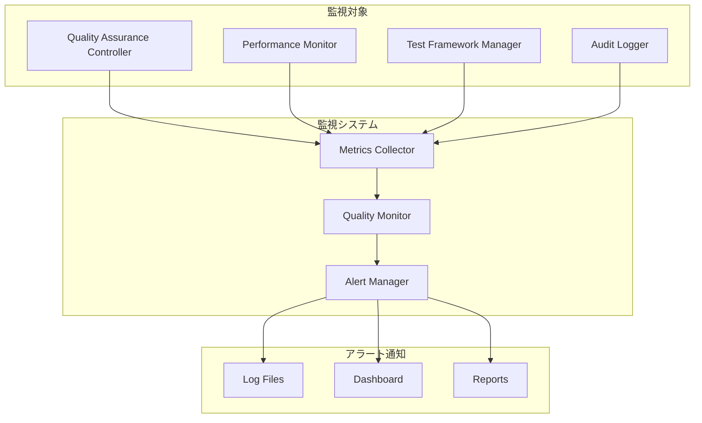

# 監視・アラート設定ガイド

## 概要

本文書は、システム品質保証フレームワークの監視・アラート機能の設定と運用方法を定義します。品質メトリクスの継続監視、異常検出、アラート通知の仕組みを提供します。

## 監視アーキテクチャ

### システム構成


## 監視項目設定

### 1. 品質メトリクス監視

#### 1.1 受け入れテスト監視
```typescript
// 受け入れテスト監視設定
const acceptanceTestMonitoring = {
  metrics: {
    passRate: {
      threshold: 100,           // 成功率 100%
      alertLevel: 'critical',   // 失敗時は Critical
      checkInterval: '5m'       // 5分間隔でチェック
    },
    executionTime: {
      threshold: 300000,        // 実行時間 5分以内
      alertLevel: 'warning',    // 超過時は Warning
      checkInterval: '1m'
    },
    coverage: {
      threshold: 90,            // カバレッジ 90%以上
      alertLevel: 'warning',
      checkInterval: '1h'
    }
  },
  alertConditions: {
    critical: 'passRate < 100',
    warning: 'executionTime > 300000 OR coverage < 90'
  }
};
```

#### 1.2 パフォーマンステスト監視
```typescript
// パフォーマンステスト監視設定
const performanceTestMonitoring = {
  metrics: {
    decisionTime: {
      threshold: 100,           // 判定時間 100ms以内
      alertLevel: 'critical',   // 超過時は Critical
      checkInterval: '1m'
    },
    memoryUsage: {
      threshold: 512,           // メモリ使用量 512MB以内
      alertLevel: 'warning',    // 超過時は Warning
      checkInterval: '5m'
    },
    cpuUsage: {
      threshold: 80,            // CPU使用率 80%以内
      alertLevel: 'warning',
      checkInterval: '1m'
    }
  },
  alertConditions: {
    critical: 'decisionTime > 100',
    warning: 'memoryUsage > 512 OR cpuUsage > 80'
  }
};
```

#### 1.3 システム健全性監視
```typescript
// システム健全性監視設定
const systemHealthMonitoring = {
  metrics: {
    componentInitialization: {
      threshold: 100,           // 初期化成功率 100%
      alertLevel: 'critical',
      checkInterval: '1m'
    },
    errorRate: {
      threshold: 1,             // エラー率 1%以内
      alertLevel: 'warning',
      checkInterval: '5m'
    },
    availability: {
      threshold: 99.9,          // 可用性 99.9%以上
      alertLevel: 'critical',
      checkInterval: '1m'
    }
  }
};
```

### 2. 監視設定の実装

#### 2.1 メトリクス収集設定
```bash
# メトリクス収集の開始
node .kiro/lib/trust-policy/demo-metrics-collector.mjs --start-monitoring

# 監視設定の確認
node .kiro/lib/trust-policy/demo-metrics-collector.mjs --show-config

# 監視状況の確認
node .kiro/lib/trust-policy/demo-metrics-collector.mjs --status
```

#### 2.2 品質監視の設定
```bash
# 品質監視の開始
node .kiro/lib/trust-policy/demo-quality-dashboard.mjs --start-monitoring

# 監視ダッシュボードの表示
node .kiro/lib/trust-policy/demo-quality-dashboard.mjs --show-dashboard

# 品質アラートの確認
node .kiro/lib/trust-policy/demo-quality-dashboard.mjs --check-alerts
```

## アラート設定

### 1. アラートレベル定義

#### 1.1 Critical アラート
**条件**:
- 受け入れテストの失敗
- パフォーマンス閾値の大幅超過 (>150ms)
- システムコンポーネントの初期化失敗
- 可用性の大幅低下 (<99%)

**対応時間**: 5分以内
**通知方法**: 即座通知 + ログ記録

#### 1.2 Warning アラート
**条件**:
- パフォーマンス閾値の軽微超過 (100-150ms)
- メモリ使用量の増加 (>512MB)
- テストカバレッジの低下 (<90%)
- エラー率の増加 (>1%)

**対応時間**: 30分以内
**通知方法**: 定期通知 + ログ記録

#### 1.3 Info アラート
**条件**:
- 品質改善の機会
- 最適化提案
- メンテナンス推奨事項

**対応時間**: 24時間以内
**通知方法**: 日次レポート

### 2. アラート通知設定

#### 2.1 通知チャネル設定
```typescript
// アラート通知設定
const alertNotificationConfig = {
  channels: {
    log: {
      enabled: true,
      path: '.kiro/reports/alerts/',
      format: 'markdown',
      retention: '30d'
    },
    dashboard: {
      enabled: true,
      updateInterval: '1m',
      historyLength: 1000
    },
    report: {
      enabled: true,
      schedule: 'daily',
      recipients: ['admin']
    }
  },
  
  alertLevels: {
    critical: {
      immediate: true,
      channels: ['log', 'dashboard'],
      escalation: '5m'
    },
    warning: {
      immediate: false,
      channels: ['log', 'dashboard'],
      escalation: '30m'
    },
    info: {
      immediate: false,
      channels: ['report'],
      escalation: 'none'
    }
  }
};
```

#### 2.2 アラート通知の実装
```bash
# アラート設定の確認
node .kiro/lib/trust-policy/demo-quality-dashboard.mjs --check-alert-config

# アラート通知のテスト
node .kiro/lib/trust-policy/demo-quality-dashboard.mjs --test-alerts

# アラート履歴の確認
node .kiro/lib/trust-policy/demo-quality-dashboard.mjs --alert-history
```

### 3. アラートルール設定

#### 3.1 品質アラートルール
```typescript
// 品質アラートルール
const qualityAlertRules = [
  {
    name: 'acceptance_test_failure',
    condition: 'acceptance_test_pass_rate < 100',
    level: 'critical',
    message: '受け入れテストが失敗しました',
    action: 'immediate_investigation'
  },
  {
    name: 'performance_degradation',
    condition: 'average_decision_time > 100',
    level: 'critical',
    message: 'パフォーマンスが劣化しています',
    action: 'performance_analysis'
  },
  {
    name: 'memory_usage_high',
    condition: 'memory_usage > 512',
    level: 'warning',
    message: 'メモリ使用量が高くなっています',
    action: 'resource_optimization'
  },
  {
    name: 'test_coverage_low',
    condition: 'test_coverage < 90',
    level: 'warning',
    message: 'テストカバレッジが低下しています',
    action: 'test_improvement'
  }
];
```

#### 3.2 システムアラートルール
```typescript
// システムアラートルール
const systemAlertRules = [
  {
    name: 'component_initialization_failure',
    condition: 'component_init_success_rate < 100',
    level: 'critical',
    message: 'コンポーネントの初期化に失敗しました',
    action: 'system_restart'
  },
  {
    name: 'high_error_rate',
    condition: 'error_rate > 1',
    level: 'warning',
    message: 'エラー率が増加しています',
    action: 'error_analysis'
  },
  {
    name: 'availability_degradation',
    condition: 'availability < 99.9',
    level: 'critical',
    message: 'システムの可用性が低下しています',
    action: 'availability_recovery'
  }
];
```

## 監視ダッシュボード

### 1. リアルタイムダッシュボード

#### 1.1 品質状況表示
```bash
# リアルタイム品質ダッシュボードの表示
node .kiro/lib/trust-policy/demo-quality-dashboard.mjs --realtime

# 品質メトリクスの表示
node .kiro/lib/trust-policy/demo-quality-dashboard.mjs --metrics

# 品質トレンドの表示
node .kiro/lib/trust-policy/demo-quality-dashboard.mjs --trends
```

#### 1.2 パフォーマンス監視表示
```bash
# パフォーマンス監視ダッシュボード
node .kiro/lib/trust-policy/demo-performance-monitor.mjs --dashboard

# パフォーマンス履歴の表示
node .kiro/lib/trust-policy/demo-performance-monitor.mjs --history

# パフォーマンス分析の表示
node .kiro/lib/trust-policy/demo-performance-monitor.mjs --analysis
```

### 2. ダッシュボード設定

#### 2.1 表示項目設定
```typescript
// ダッシュボード表示設定
const dashboardConfig = {
  layout: {
    overview: {
      position: 'top',
      widgets: ['quality_status', 'performance_summary', 'alert_count']
    },
    details: {
      position: 'middle',
      widgets: ['test_results', 'performance_metrics', 'system_health']
    },
    trends: {
      position: 'bottom',
      widgets: ['quality_trend', 'performance_trend', 'error_trend']
    }
  },
  
  refreshInterval: 60000,  // 1分間隔で更新
  historyLength: 1440,     // 24時間分の履歴
  
  thresholds: {
    quality: { good: 95, warning: 90, critical: 85 },
    performance: { good: 80, warning: 100, critical: 150 },
    availability: { good: 99.9, warning: 99.5, critical: 99.0 }
  }
};
```

#### 2.2 カスタムウィジェット
```typescript
// カスタムウィジェット設定
const customWidgets = {
  qualityScore: {
    type: 'gauge',
    title: '品質スコア',
    dataSource: 'quality_metrics',
    thresholds: [90, 95, 100]
  },
  
  performanceChart: {
    type: 'line_chart',
    title: 'パフォーマンス推移',
    dataSource: 'performance_history',
    timeRange: '24h'
  },
  
  alertSummary: {
    type: 'table',
    title: 'アクティブアラート',
    dataSource: 'active_alerts',
    columns: ['level', 'message', 'timestamp']
  }
};
```

## 監視データ管理

### 1. データ収集設定

#### 1.1 メトリクス収集間隔
```typescript
// メトリクス収集設定
const metricsCollectionConfig = {
  intervals: {
    realtime: '1s',      // リアルタイムメトリクス
    frequent: '1m',      // 頻繁な監視項目
    regular: '5m',       // 通常の監視項目
    periodic: '1h'       // 定期的な監視項目
  },
  
  categories: {
    performance: 'frequent',
    quality: 'regular',
    system: 'frequent',
    trends: 'periodic'
  }
};
```

#### 1.2 データ保持設定
```typescript
// データ保持設定
const dataRetentionConfig = {
  realtime: '1h',        // リアルタイムデータ: 1時間
  hourly: '7d',          // 時間別データ: 7日間
  daily: '30d',          // 日別データ: 30日間
  monthly: '1y',         // 月別データ: 1年間
  
  aggregation: {
    hourly: 'average',   // 時間別は平均値
    daily: 'average',    // 日別は平均値
    monthly: 'average'   // 月別は平均値
  }
};
```

### 2. ログ管理

#### 2.1 監視ログ設定
```bash
# 監視ログの確認
ls -la .kiro/reports/monitoring/

# 品質監視ログ
tail -f .kiro/reports/monitoring/quality-monitor.log

# パフォーマンス監視ログ
tail -f .kiro/reports/monitoring/performance-monitor.log

# アラートログ
tail -f .kiro/reports/monitoring/alerts.log
```

#### 2.2 ログローテーション設定
```bash
# ログローテーション設定
cat > .kiro/scripts/rotate-monitoring-logs.mjs << 'EOF'
#!/usr/bin/env node

import fs from 'fs';
import path from 'path';

const LOGS_DIR = '.kiro/reports/monitoring';
const MAX_LOG_SIZE = 10 * 1024 * 1024; // 10MB
const MAX_LOG_FILES = 5;

// ログローテーションの実行
function rotateLog(logFile) {
  const stats = fs.statSync(logFile);
  
  if (stats.size > MAX_LOG_SIZE) {
    // 古いログファイルをローテーション
    for (let i = MAX_LOG_FILES - 1; i > 0; i--) {
      const oldFile = `${logFile}.${i}`;
      const newFile = `${logFile}.${i + 1}`;
      
      if (fs.existsSync(oldFile)) {
        if (i === MAX_LOG_FILES - 1) {
          fs.unlinkSync(oldFile);
        } else {
          fs.renameSync(oldFile, newFile);
        }
      }
    }
    
    // 現在のログファイルをローテーション
    fs.renameSync(logFile, `${logFile}.1`);
    fs.writeFileSync(logFile, '');
  }
}

// 全監視ログのローテーション
const logFiles = [
  'quality-monitor.log',
  'performance-monitor.log',
  'alerts.log',
  'system-health.log'
];

logFiles.forEach(logFile => {
  const fullPath = path.join(LOGS_DIR, logFile);
  if (fs.existsSync(fullPath)) {
    rotateLog(fullPath);
  }
});

console.log('✅ ログローテーション完了');
EOF

chmod +x .kiro/scripts/rotate-monitoring-logs.mjs
```

## 監視運用手順

### 1. 監視開始手順

#### 1.1 監視システムの初期化
```bash
# 監視システムの初期化
node .kiro/lib/trust-policy/demo-metrics-collector.mjs --init

# 品質監視の開始
node .kiro/lib/trust-policy/demo-quality-dashboard.mjs --start

# パフォーマンス監視の開始
node .kiro/lib/trust-policy/demo-performance-monitor.mjs --start
```

#### 1.2 監視状況の確認
```bash
# 監視状況の確認
node .kiro/lib/trust-policy/demo-quality-dashboard.mjs --status

# メトリクス収集状況の確認
node .kiro/lib/trust-policy/demo-metrics-collector.mjs --status

# アラート設定の確認
node .kiro/lib/trust-policy/demo-quality-dashboard.mjs --check-alerts
```

### 2. 日常監視運用

#### 2.1 朝の監視確認
```bash
# 夜間の監視結果確認
node .kiro/lib/trust-policy/demo-quality-dashboard.mjs --overnight-summary

# アラート履歴の確認
node .kiro/lib/trust-policy/demo-quality-dashboard.mjs --alert-history --since=yesterday

# 品質トレンドの確認
node .kiro/lib/trust-policy/demo-quality-dashboard.mjs --trends --period=24h
```

#### 2.2 定期監視チェック
```bash
# 品質状況の定期確認 (毎時)
node .kiro/lib/trust-policy/demo-quality-dashboard.mjs --hourly-check

# パフォーマンス状況の確認 (毎時)
node .kiro/lib/trust-policy/demo-performance-monitor.mjs --hourly-check

# システム健全性の確認 (毎時)
node .kiro/lib/trust-policy/demo-metrics-collector.mjs --health-check
```

### 3. 監視停止・再開手順

#### 3.1 監視の一時停止
```bash
# 監視の一時停止
node .kiro/lib/trust-policy/demo-quality-dashboard.mjs --pause

# メトリクス収集の停止
node .kiro/lib/trust-policy/demo-metrics-collector.mjs --stop

# 監視状況の確認
node .kiro/lib/trust-policy/demo-quality-dashboard.mjs --status
```

#### 3.2 監視の再開
```bash
# 監視の再開
node .kiro/lib/trust-policy/demo-quality-dashboard.mjs --resume

# メトリクス収集の再開
node .kiro/lib/trust-policy/demo-metrics-collector.mjs --start

# 監視再開の確認
node .kiro/lib/trust-policy/demo-quality-dashboard.mjs --status
```

## トラブルシューティング

### 1. 監視システムの問題

#### 1.1 メトリクス収集の問題
**症状**: メトリクスが収集されない
**原因**: 
- 監視対象の応答なし
- 設定の問題
- リソース不足

**対処法**:
```bash
# メトリクス収集の診断
node .kiro/lib/trust-policy/demo-metrics-collector.mjs --diagnose

# 監視対象の確認
node .kiro/scripts/verify-system-readiness.mjs --monitoring-check

# 設定の確認
node .kiro/lib/trust-policy/demo-metrics-collector.mjs --check-config
```

#### 1.2 アラート通知の問題
**症状**: アラートが通知されない
**原因**:
- 通知設定の問題
- 閾値設定の問題
- 通知チャネルの問題

**対処法**:
```bash
# アラート設定の診断
node .kiro/lib/trust-policy/demo-quality-dashboard.mjs --diagnose-alerts

# 通知テストの実行
node .kiro/lib/trust-policy/demo-quality-dashboard.mjs --test-notifications

# 閾値設定の確認
node .kiro/lib/trust-policy/demo-quality-dashboard.mjs --check-thresholds
```

### 2. パフォーマンス問題

#### 2.1 監視システムの負荷
**症状**: 監視システム自体が重い
**原因**:
- 収集間隔が短すぎる
- データ量が多すぎる
- リソース不足

**対処法**:
```bash
# 監視負荷の確認
node .kiro/lib/trust-policy/demo-performance-monitor.mjs --monitor-overhead

# 収集間隔の調整
node .kiro/lib/trust-policy/demo-metrics-collector.mjs --adjust-intervals

# データクリーンアップ
node .kiro/scripts/rotate-monitoring-logs.mjs
```

## 関連ドキュメント

- [システム品質保証ガイド](.kiro/docs/SYSTEM_QUALITY_ASSURANCE_GUIDE.md)
- [運用手順書](.kiro/docs/OPERATIONS_MANUAL.md)
- [障害対応手順書](.kiro/docs/INCIDENT_RESPONSE_GUIDE.md)
- [品質管理プロセス](.kiro/docs/QUALITY_MANAGEMENT_PROCESS.md)

---

**最終更新**: 2025-08-29  
**バージョン**: 1.0  
**対象システム**: システム品質保証フレームワーク