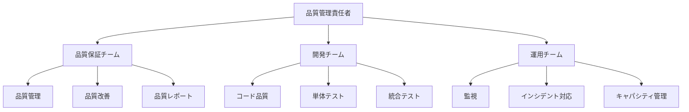
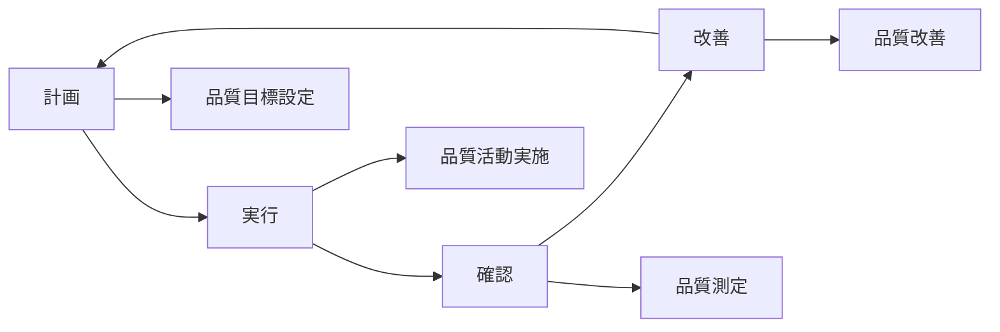

# 品質管理プロセス

## 概要

本文書は、システム品質保証フレームワークにおける品質管理プロセスを定義します。継続的な品質向上、品質基準の管理、品質保証活動の標準化を目的とした包括的なプロセスを提供します。

## 品質管理体系

### 1. 品質管理の基本方針

#### 1.1 品質方針
- **顧客満足の最大化**: ユーザーのニーズを満たす高品質なシステム
- **継続的改善**: PDCAサイクルによる継続的な品質向上
- **予防重視**: 問題の早期発見と予防的対策
- **データ駆動**: 客観的なデータに基づく品質判断

#### 1.2 品質目標
```typescript
// 品質目標の定義
const qualityObjectives = {
  reliability: {
    availability: 99.9,        // 可用性 99.9%以上
    errorRate: 0.1,           // エラー率 0.1%以下
    mtbf: 720                 // 平均故障間隔 720時間以上
  },
  performance: {
    responseTime: 100,        // 応答時間 100ms以下
    throughput: 1000,         // スループット 1000req/s以上
    resourceUsage: 80         // リソース使用率 80%以下
  },
  maintainability: {
    testCoverage: 90,         // テストカバレッジ 90%以上
    codeQuality: 8.0,         // コード品質スコア 8.0以上
    documentation: 95         // ドキュメント完成度 95%以上
  }
};
```

### 2. 品質管理組織

#### 2.1 品質管理体制


#### 2.2 役割と責任
- **品質管理責任者**: 品質方針の策定、品質目標の設定
- **品質保証チーム**: 品質基準の管理、品質監査の実施
- **開発チーム**: コード品質の確保、テストの実施
- **運用チーム**: システム監視、インシデント対応

## 品質管理プロセス

### 1. 品質計画 (Quality Planning)

#### 1.1 品質計画の策定
```bash
# 品質計画の生成
node .kiro/scripts/generate-quality-plan.mjs

# 品質目標の設定
node .kiro/lib/trust-policy/demo-quality-dashboard.mjs --set-objectives

# 品質基準の定義
node .kiro/lib/trust-policy/demo-quality-gate-manager.mjs --define-standards
```

#### 1.2 品質計画の内容
1. **品質目標の設定**
   - 定量的な品質目標
   - 測定可能な品質指標
   - 達成期限の設定

2. **品質基準の定義**
   - 受け入れ基準
   - パフォーマンス基準
   - セキュリティ基準

3. **品質活動の計画**
   - レビュー計画
   - テスト計画
   - 監査計画

#### 1.3 品質計画の承認
```bash
# 品質計画の確認
node .kiro/lib/trust-policy/demo-quality-report-generator.mjs --plan-review

# ステークホルダーレビュー
node .kiro/scripts/stakeholder-review.mjs --type=quality-plan

# 品質計画の承認
node .kiro/scripts/approve-quality-plan.mjs
```

### 2. 品質保証 (Quality Assurance)

#### 2.1 品質保証活動
```bash
# 品質保証チェックの実行
node .kiro/scripts/run-quality-check.mjs --comprehensive

# 品質監査の実行
node .kiro/lib/trust-policy/demo-quality-dashboard.mjs --audit

# プロセス適合性の確認
node .kiro/scripts/verify-process-compliance.mjs
```

#### 2.2 品質レビュー
1. **設計レビュー**
   - アーキテクチャレビュー
   - 設計品質の確認
   - 品質リスクの評価

2. **コードレビュー**
   - コード品質の確認
   - 標準適合性の確認
   - セキュリティレビュー

3. **テストレビュー**
   - テスト計画のレビュー
   - テストケースのレビュー
   - テスト結果のレビュー

#### 2.3 品質監査
```bash
# 内部品質監査の実行
node .kiro/scripts/internal-quality-audit.mjs

# 監査結果の分析
node .kiro/lib/trust-policy/demo-quality-report-generator.mjs --audit-analysis

# 改善計画の策定
node .kiro/scripts/create-improvement-plan.mjs
```

### 3. 品質管理 (Quality Control)

#### 3.1 品質測定
```bash
# 品質メトリクスの収集
node .kiro/lib/trust-policy/demo-metrics-collector.mjs --quality-metrics

# 品質データの分析
node .kiro/lib/trust-policy/demo-quality-dashboard.mjs --analyze

# 品質トレンドの確認
node .kiro/lib/trust-policy/demo-quality-report-generator.mjs --trends
```

#### 3.2 品質監視
```typescript
// 品質監視設定
const qualityMonitoring = {
  metrics: {
    defectRate: {
      threshold: 0.1,
      alertLevel: 'warning',
      trend: 'decreasing'
    },
    testPassRate: {
      threshold: 95,
      alertLevel: 'critical',
      trend: 'stable'
    },
    performanceScore: {
      threshold: 80,
      alertLevel: 'warning',
      trend: 'improving'
    }
  },
  
  monitoring: {
    frequency: 'hourly',
    retention: '30d',
    alerting: true
  }
};
```

#### 3.3 品質改善
```bash
# 品質問題の特定
node .kiro/lib/trust-policy/demo-quality-dashboard.mjs --identify-issues

# 改善策の提案
node .kiro/scripts/suggest-improvements.mjs

# 改善効果の測定
node .kiro/scripts/measure-improvement-impact.mjs
```

### 4. 品質改善 (Quality Improvement)

#### 4.1 継続的改善プロセス


#### 4.2 改善活動の実施
```bash
# 改善プロジェクトの開始
node .kiro/scripts/start-improvement-project.mjs

# 改善活動の監視
node .kiro/scripts/monitor-improvement-progress.mjs

# 改善効果の評価
node .kiro/scripts/evaluate-improvement-results.mjs
```

## 品質基準管理

### 1. 品質基準の定義

#### 1.1 機能品質基準
```typescript
// 機能品質基準
const functionalQualityStandards = {
  correctness: {
    defectDensity: 0.1,       // 欠陥密度 0.1件/KLOC以下
    testPassRate: 100,        // テスト合格率 100%
    requirementsCoverage: 100  // 要件カバレッジ 100%
  },
  
  reliability: {
    availability: 99.9,       // 可用性 99.9%以上
    mtbf: 720,               // 平均故障間隔 720時間以上
    mttr: 30                 // 平均復旧時間 30分以下
  },
  
  usability: {
    responseTime: 3,         // 応答時間 3秒以下
    errorRecovery: 95,       // エラー回復率 95%以上
    userSatisfaction: 4.0    // ユーザー満足度 4.0以上
  }
};
```

#### 1.2 非機能品質基準
```typescript
// 非機能品質基準
const nonFunctionalQualityStandards = {
  performance: {
    responseTime: 100,        // 応答時間 100ms以下
    throughput: 1000,         // スループット 1000req/s以上
    concurrency: 100          // 同時接続数 100以上
  },
  
  scalability: {
    horizontalScaling: true,  // 水平スケーリング対応
    loadCapacity: 10000,      // 負荷容量 10000req/s
    resourceEfficiency: 80    // リソース効率 80%以上
  },
  
  security: {
    vulnerabilities: 0,       // 脆弱性 0件
    accessControl: 100,       // アクセス制御 100%
    dataProtection: 100       // データ保護 100%
  }
};
```

### 2. 品質基準の管理

#### 2.1 基準の設定と更新
```bash
# 品質基準の設定
node .kiro/lib/trust-policy/demo-quality-gate-manager.mjs --set-standards

# 基準の妥当性確認
node .kiro/scripts/validate-quality-standards.mjs

# 基準の更新
node .kiro/lib/trust-policy/demo-quality-gate-manager.mjs --update-standards
```

#### 2.2 基準適合性の確認
```bash
# 基準適合性チェック
node .kiro/scripts/check-standards-compliance.mjs

# 適合性レポートの生成
node .kiro/lib/trust-policy/demo-quality-report-generator.mjs --compliance-report

# 非適合項目の特定
node .kiro/scripts/identify-non-compliance.mjs
```

## 品質測定・評価

### 1. 品質メトリクス

#### 1.1 プロセスメトリクス
```typescript
// プロセスメトリクス
const processMetrics = {
  development: {
    codeReviewCoverage: 100,  // コードレビューカバレッジ
    testAutomationRate: 90,   // テスト自動化率
    defectDetectionRate: 95   // 欠陥検出率
  },
  
  testing: {
    testCoverage: 90,         // テストカバレッジ
    testExecutionRate: 100,   // テスト実行率
    defectLeakageRate: 5      // 欠陥漏れ率
  },
  
  deployment: {
    deploymentFrequency: 10,  // デプロイ頻度（回/月）
    deploymentSuccessRate: 95, // デプロイ成功率
    rollbackRate: 5           // ロールバック率
  }
};
```

#### 1.2 製品メトリクス
```typescript
// 製品メトリクス
const productMetrics = {
  functionality: {
    featureCompleteness: 100, // 機能完成度
    requirementsTrace: 100,   // 要件トレーサビリティ
    apiCompliance: 100        // API準拠性
  },
  
  reliability: {
    systemUptime: 99.9,       // システム稼働率
    errorRate: 0.1,           // エラー率
    recoveryTime: 30          // 復旧時間
  },
  
  performance: {
    responseTime: 100,        // 応答時間
    throughput: 1000,         // スループット
    resourceUtilization: 80   // リソース使用率
  }
};
```

### 2. 品質評価

#### 2.1 品質評価の実施
```bash
# 品質評価の実行
node .kiro/scripts/evaluate-quality.mjs

# 品質スコアの計算
node .kiro/lib/trust-policy/demo-quality-dashboard.mjs --calculate-score

# 品質ランキングの確認
node .kiro/lib/trust-policy/demo-quality-report-generator.mjs --ranking
```

#### 2.2 品質評価基準
```typescript
// 品質評価基準
const qualityEvaluationCriteria = {
  excellent: {
    score: 90,
    description: '優秀な品質レベル',
    action: '現状維持'
  },
  
  good: {
    score: 80,
    description: '良好な品質レベル',
    action: '継続的改善'
  },
  
  acceptable: {
    score: 70,
    description: '許容可能な品質レベル',
    action: '改善計画策定'
  },
  
  poor: {
    score: 60,
    description: '品質改善が必要',
    action: '緊急改善実施'
  }
};
```

## 品質レポート

### 1. 品質レポートの種類

#### 1.1 日次品質レポート
```bash
# 日次品質レポートの生成
node .kiro/lib/trust-policy/demo-quality-report-generator.mjs --daily

# レポート内容の確認
cat .kiro/reports/daily-quality-report-$(date +%Y-%m-%d).md
```

**内容**:
- 品質メトリクスの現状
- 前日からの変化
- 発生した問題
- 対応状況

#### 1.2 週次品質レポート
```bash
# 週次品質レポートの生成
node .kiro/lib/trust-policy/demo-quality-report-generator.mjs --weekly

# トレンド分析の確認
node .kiro/lib/trust-policy/demo-quality-dashboard.mjs --weekly-trends
```

**内容**:
- 週間品質トレンド
- 品質目標の達成状況
- 改善活動の進捗
- 次週の計画

#### 1.3 月次品質レポート
```bash
# 月次品質レポートの生成
node .kiro/lib/trust-policy/demo-quality-report-generator.mjs --monthly

# 包括的分析の実行
node .kiro/scripts/comprehensive-quality-analysis.mjs
```

**内容**:
- 月間品質総括
- 品質目標の達成評価
- 改善効果の測定
- 次月の品質計画

### 2. レポート配布・活用

#### 2.1 レポート配布
```bash
# レポートの配布
node .kiro/scripts/distribute-quality-reports.mjs

# 配布状況の確認
node .kiro/scripts/check-report-distribution.mjs
```

#### 2.2 レポート活用
- **経営層**: 月次レポートによる品質状況の把握
- **管理層**: 週次レポートによる改善計画の策定
- **現場**: 日次レポートによる日常業務の改善

## 品質改善活動

### 1. 改善プロジェクト管理

#### 1.1 改善プロジェクトの開始
```bash
# 改善プロジェクトの立ち上げ
node .kiro/scripts/start-improvement-project.mjs --name="Performance Optimization"

# プロジェクト計画の作成
node .kiro/scripts/create-project-plan.mjs --project-id=perf-opt-001

# リソースの割り当て
node .kiro/scripts/allocate-project-resources.mjs --project-id=perf-opt-001
```

#### 1.2 改善活動の監視
```bash
# プロジェクト進捗の確認
node .kiro/scripts/monitor-project-progress.mjs --project-id=perf-opt-001

# マイルストーンの確認
node .kiro/scripts/check-project-milestones.mjs --project-id=perf-opt-001

# リスクの評価
node .kiro/scripts/assess-project-risks.mjs --project-id=perf-opt-001
```

### 2. 改善効果の測定

#### 2.1 改善前後の比較
```bash
# ベースライン測定
node .kiro/scripts/measure-baseline.mjs --metrics=performance

# 改善後測定
node .kiro/scripts/measure-post-improvement.mjs --metrics=performance

# 改善効果の計算
node .kiro/scripts/calculate-improvement-impact.mjs
```

#### 2.2 改善効果の評価
```typescript
// 改善効果評価基準
const improvementEvaluationCriteria = {
  significant: {
    threshold: 20,
    description: '大幅な改善',
    action: '成功事例として展開'
  },
  
  moderate: {
    threshold: 10,
    description: '中程度の改善',
    action: '継続的な監視'
  },
  
  minimal: {
    threshold: 5,
    description: '軽微な改善',
    action: '追加改善の検討'
  },
  
  none: {
    threshold: 0,
    description: '改善効果なし',
    action: '原因分析と再計画'
  }
};
```

## 品質文化の醸成

### 1. 品質意識の向上

#### 1.1 品質教育・研修
- **品質基礎研修**: 品質管理の基本概念
- **技術研修**: 品質向上技術の習得
- **プロセス研修**: 品質プロセスの理解

#### 1.2 品質活動の推進
```bash
# 品質活動の企画
node .kiro/scripts/plan-quality-activities.mjs

# 品質イベントの開催
node .kiro/scripts/organize-quality-events.mjs

# 品質成果の共有
node .kiro/scripts/share-quality-achievements.mjs
```

### 2. 品質文化の定着

#### 2.1 品質指標の可視化
```bash
# 品質ダッシュボードの表示
node .kiro/lib/trust-policy/demo-quality-dashboard.mjs --public-dashboard

# 品質ランキングの公開
node .kiro/scripts/publish-quality-ranking.mjs

# 品質成果の表彰
node .kiro/scripts/recognize-quality-achievements.mjs
```

#### 2.2 継続的な改善文化
- **改善提案制度**: 全員参加の改善活動
- **品質サークル**: 小集団による品質改善
- **ベストプラクティス共有**: 成功事例の横展開

## 関連ドキュメント

- [システム品質保証ガイド](.kiro/docs/SYSTEM_QUALITY_ASSURANCE_GUIDE.md)
- [運用手順書](.kiro/docs/OPERATIONS_MANUAL.md)
- [監視・アラート設定ガイド](.kiro/docs/MONITORING_ALERT_GUIDE.md)
- [障害対応手順書](.kiro/docs/INCIDENT_RESPONSE_GUIDE.md)

---

**最終更新**: 2025-08-29  
**バージョン**: 1.0  
**対象システム**: システム品質保証フレームワーク