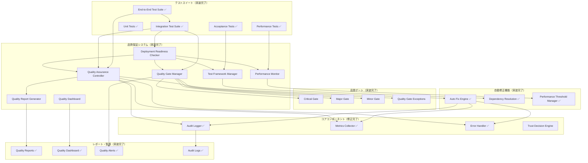

# システム品質保証ガイド

**バージョン:** 1.0  
**最終更新:** 2025-08-29  
**対象:** 開発者、品質保証担当者、システム管理者

## 概要

このドキュメントは、Trust承認ポリシーシステムの品質保証機能について包括的に説明します。システムの品質チェック、デプロイメント準備確認、品質ゲート管理、統合テスト、エンドツーエンドテストの実装と運用方法を詳述します。

## システムアーキテクチャ

### 全体構成



### コンポーネント詳細

#### 1. Quality Assurance Controller
- **役割**: 品質保証プロセス全体の統括
- **機能**: 品質チェック実行、問題の自動検出・修正、品質レポート生成
- **API**: `runQualityCheck()`, `autoFixIssues()`, `generateQualityReport()`

#### 2. Deployment Readiness Checker
- **役割**: デプロイメント準備状況の確認
- **機能**: 品質ゲート評価、デプロイ許可発行、デプロイ後検証
- **API**: `checkDeploymentReadiness()`, `grantDeploymentPermission()`, `runPostDeploymentVerification()`

#### 3. Quality Gate Manager
- **役割**: 品質ゲートの管理と実行
- **機能**: Critical/Major/Minor品質ゲート、例外管理、動的閾値調整
- **API**: `executeQualityGates()`, `createException()`, `adjustQualityThresholds()`

#### 4. Performance Monitor
- **役割**: パフォーマンス監視と最適化
- **機能**: リアルタイム監視、閾値チェック、パフォーマンスレポート
- **API**: `checkPerformanceThresholds()`, `quickPerformanceCheck()`

#### 5. Test Framework Manager
- **役割**: テスト実行環境の管理
- **機能**: 依存関係解決、テスト実行統括、結果統合分析
- **API**: `runAllTests()`, `runCriticalFunctionalityTests()`, `runAuditLogTests()`

## API仕様

### Quality Assurance Controller API

#### runQualityCheck()
```typescript
async runQualityCheck(): Promise<QualityCheckResult>
```

**説明**: システム全体の品質チェックを実行します。

**戻り値**:
```typescript
interface QualityCheckResult {
  passed: boolean;
  issues: QualityIssue[];
  summary: {
    total: number;
    critical: number;
    high: number;
    medium: number;
    low: number;
    autoFixed: number;
  };
  recommendations: string[];
}
```

**使用例**:
```typescript
const controller = new QualityAssuranceController();
await controller.initialize();
const result = await controller.runQualityCheck();

if (result.passed) {
  console.log('品質チェック合格');
} else {
  console.log(`${result.issues.length}件の問題が検出されました`);
}
```

#### autoFixIssues()
```typescript
async autoFixIssues(issues: QualityIssue[]): Promise<FixResult[]>
```

**説明**: 検出された品質問題の自動修正を実行します。

**パラメータ**:
- `issues`: 修正対象の品質問題配列

**戻り値**:
```typescript
interface FixResult {
  issueId: string;
  success: boolean;
  appliedAt: Date;
  fixDescription: string;
  validationResult?: boolean;
  error?: string;
  rollbackAvailable: boolean;
}
```

### Deployment Readiness Checker API

#### checkDeploymentReadiness()
```typescript
async checkDeploymentReadiness(): Promise<DeploymentReadiness>
```

**説明**: デプロイメント準備状況を包括的にチェックします。

**戻り値**:
```typescript
interface DeploymentReadiness {
  ready: boolean;
  score: number;
  blockers: DeploymentBlocker[];
  warnings: DeploymentWarning[];
  recommendations: string[];
  qualityGates: QualityGateResult[];
  timestamp: Date;
}
```

#### grantDeploymentPermission()
```typescript
async grantDeploymentPermission(readiness: DeploymentReadiness): Promise<DeploymentPermission>
```

**説明**: デプロイメント許可を発行します（準備完了時のみ）。

**戻り値**:
```typescript
interface DeploymentPermission {
  granted: boolean;
  grantedAt: Date;
  validUntil: Date;
  conditions: string[];
  approver: string;
}
```

### Quality Gate Manager API

#### executeQualityGates()
```typescript
async executeQualityGates(context: { [key: string]: any }): Promise<QualityGateExecutionResult>
```

**説明**: 品質ゲートを実行します。

**パラメータ**:
- `context`: メトリクス値を含むコンテキストオブジェクト

**戻り値**:
```typescript
interface QualityGateExecutionResult {
  overallStatus: QualityGateStatus;
  executions: QualityGateExecution[];
  summary: {
    total: number;
    passed: number;
    failed: number;
    warnings: number;
    skipped: number;
    blocked: boolean;
  };
  recommendations: string[];
}
```

## 設定ガイド

### 品質ゲート設定

品質ゲートの設定は `.kiro/settings/quality-gates.json` で管理されます。システム品質保証機能の実装により、以下の設定が利用可能になりました。

#### 実装済み品質ゲート

1. **Critical Functionality Gate** - 必須機能の動作確認
2. **Performance Standards Gate** - パフォーマンス基準の確認
3. **Quality Metrics Gate** - 品質メトリクスの確認

#### 自動修正機能設定

```json
{
  "autoFix": {
    "enabled": true,
    "maxAttempts": 3,
    "supportedIssueTypes": [
      "missing_method",
      "invalid_config",
      "performance_degradation",
      "initialization_error"
    ],
    "rollbackOnFailure": true
  }
}
```

```json
{
  "version": "1.0",
  "lastUpdated": "2025-08-29T00:00:00.000Z",
  "gates": [
    {
      "id": "critical-functionality",
      "name": "Critical Functionality",
      "level": "critical",
      "description": "Essential functionality must work correctly",
      "criteria": [
        {
          "id": "test-pass-rate",
          "name": "Test Pass Rate",
          "description": "Percentage of tests that pass",
          "metric": "test_pass_rate",
          "threshold": 100,
          "operator": "==",
          "weight": 10,
          "mandatory": true,
          "category": "testing"
        }
      ],
      "blocking": true,
      "enabled": true,
      "order": 1,
      "dependencies": [],
      "timeout": 300
    }
  ],
  "globalSettings": {
    "enableParallelExecution": false,
    "maxConcurrentGates": 3,
    "defaultTimeout": 300,
    "failFast": true,
    "retryAttempts": 2,
    "retryDelay": 1000
  },
  "thresholds": {
    "critical": {
      "minPassRate": 100,
      "maxFailures": 0
    },
    "major": {
      "minPassRate": 90,
      "maxFailures": 1
    },
    "minor": {
      "minPassRate": 80,
      "maxFailures": 2
    }
  }
}
```

### パフォーマンス監視設定

パフォーマンス監視の閾値設定:

```typescript
const PERFORMANCE_THRESHOLDS = {
  executionTime: 100,    // 100ms以内
  memoryUsage: 512 * 1024 * 1024, // 512MB
  cpuUsage: 80,          // 80%
  responseTime: 50,      // 50ms以内
  throughput: 1000       // 1000 operations/sec
};
```

### テスト設定

テストフレームワークの設定:

```typescript
const TEST_CONFIGURATION = {
  timeout: 30000,        // 30秒
  retryAttempts: 3,      // 3回リトライ
  parallelExecution: true,
  testTypes: ['unit', 'integration', 'e2e'],
  coverage: {
    threshold: 80,       // 80%以上
    includePattern: ['src/**/*.ts'],
    excludePattern: ['**/*.test.ts', '**/*.spec.ts']
  }
};
```

## 運用手順

### 日常運用

#### 1. 品質チェックの実行

```bash
# 手動実行
node .kiro/scripts/run-quality-check.mjs

# 自動実行（CI/CD）
npm run quality:check
```

#### 2. デプロイメント準備確認

```bash
# デプロイメント準備チェック
node .kiro/lib/trust-policy/demo-deployment-readiness-simple.mjs

# 品質ゲート実行
node .kiro/lib/trust-policy/demo-quality-gate-manager.mjs
```

#### 3. テスト実行

```bash
# 統合テスト
node .kiro/scripts/run-integration-tests.mjs

# エンドツーエンドテスト
node .kiro/scripts/run-end-to-end-tests.mjs
```

### 定期メンテナンス

#### 週次タスク
- [ ] 統合テストの実行
- [ ] パフォーマンス監視レポートの確認
- [ ] 品質メトリクスの分析
- [ ] 例外設定の見直し

#### 月次タスク
- [ ] 品質ゲート設定の見直し
- [ ] 閾値の調整
- [ ] テストカバレッジの確認
- [ ] システム全体のヘルスチェック

### トラブルシューティング

#### よくある問題と解決方法

**問題**: 品質チェックが失敗する
```
解決方法:
1. ログファイルを確認: .kiro/reports/quality-check-*.md
2. 具体的なエラーメッセージを確認
3. 自動修正が可能な場合は実行
4. 手動修正が必要な場合は該当コンポーネントを修正
```

**問題**: デプロイメントがブロックされる
```
解決方法:
1. ブロッカーの詳細を確認
2. 品質ゲートの失敗原因を特定
3. 必要に応じて例外を作成
4. 根本原因を修正してリトライ
```

**問題**: パフォーマンステストが失敗する
```
解決方法:
1. パフォーマンス閾値を確認
2. システムリソースの使用状況をチェック
3. 最適化が必要な箇所を特定
4. 閾値の調整を検討
```

## 開発者向けガイド

### 新しい品質チェックの追加

1. **品質問題タイプの定義**:
```typescript
export enum QualityIssueType {
  EXISTING_TYPE = 'existing_type',
  NEW_CUSTOM_TYPE = 'new_custom_type'  // 新しいタイプを追加
}
```

2. **チェック関数の実装**:
```typescript
private async checkNewCustomType(): Promise<QualityIssue[]> {
  const issues: QualityIssue[] = [];
  
  // チェックロジックを実装
  try {
    // 検証処理
    const result = await performCustomCheck();
    
    if (!result.passed) {
      issues.push({
        id: 'new-custom-check-failed',
        type: QualityIssueType.NEW_CUSTOM_TYPE,
        severity: 'high',
        component: 'CustomComponent',
        description: 'Custom check failed',
        detectedAt: new Date(),
        autoFixable: true,
        fixApplied: false
      });
    }
  } catch (error) {
    // エラーハンドリング
  }
  
  return issues;
}
```

3. **自動修正の実装**:
```typescript
this.autoFixActions.set(QualityIssueType.NEW_CUSTOM_TYPE, {
  issueType: QualityIssueType.NEW_CUSTOM_TYPE,
  description: 'Custom issue auto-fix',
  execute: async (issue: QualityIssue) => {
    // 修正処理を実装
    return await performCustomFix(issue);
  },
  validate: async (issue: QualityIssue) => {
    // 修正結果の検証
    return await validateCustomFix(issue);
  }
});
```

### 新しい品質ゲートの追加

1. **ゲート定義の追加**:
```json
{
  "id": "new-custom-gate",
  "name": "New Custom Gate",
  "level": "major",
  "description": "Custom quality gate description",
  "criteria": [
    {
      "id": "custom-metric",
      "name": "Custom Metric",
      "description": "Custom metric description",
      "metric": "custom_metric_value",
      "threshold": 80,
      "operator": ">=",
      "weight": 8,
      "mandatory": true,
      "category": "custom"
    }
  ],
  "blocking": true,
  "enabled": true,
  "order": 4,
  "dependencies": ["critical-functionality"],
  "timeout": 180
}
```

2. **メトリクス計算の実装**:
```typescript
private calculateCustomMetric(context: { [key: string]: any }): number {
  // カスタムメトリクスの計算ロジック
  const customValue = context.customData || 0;
  const processedValue = processCustomData(customValue);
  
  return Math.max(0, Math.min(100, processedValue));
}
```

### テストの追加

1. **ユニットテストの追加**:
```typescript
describe('New Custom Feature', () => {
  it('should handle custom scenario correctly', async () => {
    // テストの実装
    const result = await customFeature.execute();
    expect(result.success).toBe(true);
  });
});
```

2. **統合テストの追加**:
```typescript
describe('Custom Integration Tests', () => {
  it('should integrate with existing components', async () => {
    // 統合テストの実装
    const integration = await testCustomIntegration();
    expect(integration.compatible).toBe(true);
  });
});
```

## ベストプラクティス

### 品質保証

1. **継続的品質監視**
   - 定期的な品質チェックの実行
   - メトリクスの継続的な収集と分析
   - 品質トレンドの監視

2. **プロアクティブな問題対応**
   - 早期警告システムの活用
   - 自動修正機能の積極的な利用
   - 根本原因分析の実施

3. **品質ゲートの適切な設定**
   - ビジネス要件に基づいた閾値設定
   - 段階的な品質基準の適用
   - 例外管理の適切な運用

### パフォーマンス

1. **効率的なテスト実行**
   - 並行実行の活用
   - テストの優先順位付け
   - 早期失敗の実装

2. **リソース管理**
   - メモリ使用量の監視
   - CPU使用率の最適化
   - ガベージコレクションの考慮

3. **スケーラビリティ**
   - 負荷に応じた動的調整
   - キャッシュの効果的な活用
   - 非同期処理の適切な実装

### セキュリティ

1. **設定ファイルの保護**
   - 適切なファイル権限の設定
   - 機密情報の暗号化
   - アクセスログの記録

2. **実行環境の分離**
   - テスト環境と本番環境の分離
   - サンドボックス環境での実行
   - 権限の最小化

## 関連ドキュメント

- [Trust承認ポリシー運用ガイド](.kiro/steering/trust-usage.md)
- [セキュリティガイドライン](.kiro/steering/security.md)
- [MCP使用ガイドライン](.kiro/steering/mcp-usage.md)
- [Git運用ルール](.kiro/steering/git-operation-rules.md)

## 更新履歴

| バージョン | 日付 | 変更内容 |
|-----------|------|----------|
| 1.0 | 2025-08-29 | 初版作成 |

---

**注意**: このドキュメントは継続的に更新されます。最新版は常にリポジトリで確認してください。