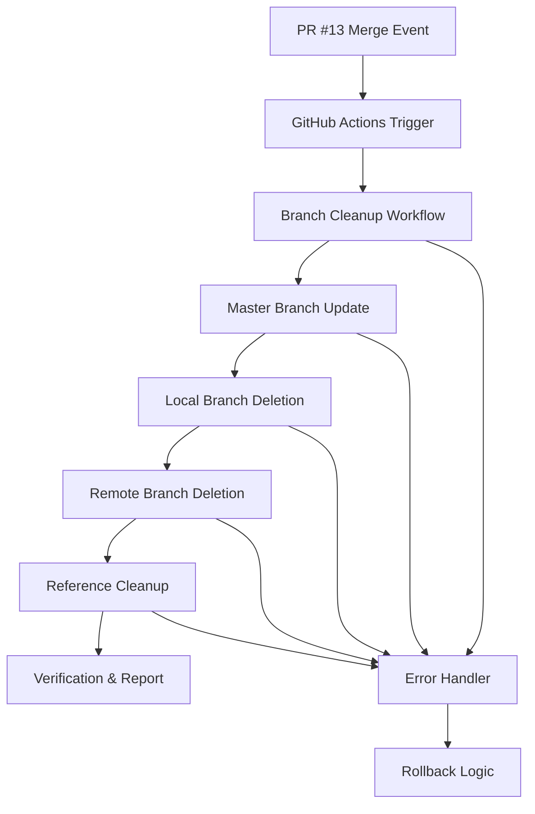

# Design Document

## Overview

PR #13 (chore/checkpoint-commit → master) のマージ完了を自動検知し、ブランチクリーンアップを実行する自動化システムを設計します。GitHub Actionsワークフローを使用して、マージイベントをトリガーとした自動化処理を実装し、リポジトリを本番運用に適した状態に整理します。

## Architecture

### システム構成



### トリガー設計

1. **イベントトリガー**: `pull_request` の `closed` イベント
2. **条件フィルタリング**: 
   - `github.event.pull_request.merged == true`
   - `github.event.pull_request.base.ref == 'master'`
   - `github.event.pull_request.head.ref == 'chore/checkpoint-commit'`
   - `github.event.number == 13`

### 実行環境

- **Runner**: `ubuntu-latest`
- **Node.js**: プロジェクト標準バージョン（20.x）
- **Git**: GitHub Actions標準Git環境
- **権限**: `contents: write`, `pull-requests: read`

## Components and Interfaces

### 1. Workflow Trigger Component

**責任**: PR #13のマージイベントを検知し、適切な条件でワークフローを開始

```yaml
name: Branch Cleanup Automation
on:
  pull_request:
    types: [closed]
    branches: [master]
```

**インターフェース**:
- Input: GitHub webhook event
- Output: ワークフロー実行開始

### 2. Branch Update Component

**責任**: masterブランチを最新状態に更新

```bash
git switch master
git pull --ff-only
```

**インターフェース**:
- Input: リポジトリ状態
- Output: 更新されたmasterブランチ

### 3. Local Branch Cleanup Component

**責任**: ローカルの不要ブランチを削除

```bash
git branch -D chore/checkpoint-commit || true
```

**インターフェース**:
- Input: ブランチ名
- Output: 削除結果（成功/失敗）

### 4. Remote Branch Cleanup Component

**責任**: リモートの不要ブランチを削除

```bash
git push origin --delete chore/checkpoint-commit || true
```

**インターフェース**:
- Input: リモートブランチ名
- Output: 削除結果（成功/失敗）

### 5. Reference Cleanup Component

**責任**: 不要なリファレンスとタグを整理

```bash
git fetch --prune --tags
```

**インターフェース**:
- Input: リポジトリ状態
- Output: 整理されたリファレンス

### 6. Verification Component

**責任**: クリーンアップ完了後の状態検証

```bash
git branch -a
git ls-remote --heads origin
```

**インターフェース**:
- Input: リポジトリ状態
- Output: 検証レポート

## Data Models

### Workflow Context

```typescript
interface WorkflowContext {
  pullRequest: {
    number: number;
    merged: boolean;
    base: { ref: string };
    head: { ref: string };
  };
  repository: {
    name: string;
    owner: string;
  };
  actor: string;
}
```

### Cleanup Result

```typescript
interface CleanupResult {
  masterUpdate: {
    success: boolean;
    message: string;
  };
  localBranchDeletion: {
    success: boolean;
    message: string;
  };
  remoteBranchDeletion: {
    success: boolean;
    message: string;
  };
  referenceCleanup: {
    success: boolean;
    message: string;
  };
  verification: {
    localBranches: string[];
    remoteBranches: string[];
    isCleanupComplete: boolean;
  };
}
```

## Error Handling

### エラー分類と対応

1. **Critical Errors** (処理中断)
   - masterブランチへの切り替え失敗
   - 権限不足エラー
   - リポジトリアクセス失敗

2. **Non-Critical Errors** (処理継続)
   - ブランチが既に削除済み
   - リモートブランチ削除失敗
   - タグ整理の部分的失敗

### エラーハンドリング戦略

```yaml
- name: Handle Critical Error
  if: failure()
  run: |
    echo "::error::Critical error occurred during cleanup"
    echo "::error::Repository state may be inconsistent"
    echo "::error::Manual intervention required"
    exit 1

- name: Handle Non-Critical Error
  if: failure()
  run: |
    echo "::warning::Non-critical error occurred"
    echo "::warning::Continuing with next step"
  continue-on-error: true
```

### ロールバック戦略

- **masterブランチ**: 変更なし（read-onlyアクセス）
- **ブランチ削除**: 不可逆操作のため、事前バックアップ不要
- **リファレンス**: `git reflog`による復旧可能

## Testing Strategy

### 1. Unit Testing

**対象**: 個別のGitコマンド実行
- masterブランチ更新テスト
- ブランチ削除コマンドテスト
- リファレンス整理テスト

### 2. Integration Testing

**対象**: ワークフロー全体の動作
- PR #13マージシミュレーション
- 条件分岐テスト
- エラーハンドリングテスト

### 3. End-to-End Testing

**対象**: 実際のGitHub環境での動作
- テストリポジトリでの実行
- 権限設定の検証
- 通知機能の確認

### テスト環境設定

```yaml
# テスト用ワークフロー
name: Test Branch Cleanup
on:
  workflow_dispatch:
    inputs:
      test_pr_number:
        description: 'Test PR number'
        required: true
        default: '13'
```

## Security Considerations

### 権限管理

- **最小権限の原則**: 必要最小限の権限のみ付与
- **トークン管理**: `GITHUB_TOKEN`の適切な使用
- **ブランチ保護**: masterブランチの保護ルール遵守

### 安全性チェック

1. **事前検証**
   - PR番号の確認
   - マージ状態の確認
   - ブランチ名の確認

2. **実行時検証**
   - fast-forward onlyマージの強制
   - 保護ルールの遵守確認
   - 権限チェック

3. **事後検証**
   - 期待される状態の確認
   - 不整合の検出
   - レポート生成

### セキュリティ制約

```yaml
permissions:
  contents: write      # ブランチ削除に必要
  pull-requests: read  # PR情報読み取りに必要
  actions: read        # ワークフロー状態確認に必要
```

## Performance Considerations

### 実行時間最適化

- **並列実行**: 独立したタスクの並列化
- **条件分岐**: 不要な処理のスキップ
- **キャッシュ活用**: Git操作の最適化

### リソース使用量

- **メモリ**: 標準的なGit操作のみ
- **ネットワーク**: 最小限のリモート通信
- **ストレージ**: 一時的なワークスペースのみ

## Monitoring and Logging

### ログ出力

```yaml
- name: Log Cleanup Progress
  run: |
    echo "::group::Branch Cleanup Progress"
    echo "Step: Master branch update"
    echo "Status: In progress"
    echo "::endgroup::"
```

### 通知設定

- **成功時**: GitHub Actions summary
- **失敗時**: Issue作成またはSlack通知
- **部分失敗**: Warning表示

### メトリクス収集

- 実行時間
- 成功/失敗率
- エラー分類
- リポジトリ状態変化

## Deployment Strategy

### 段階的デプロイ

1. **Phase 1**: テスト環境での検証
2. **Phase 2**: 条件付き本番デプロイ
3. **Phase 3**: 完全自動化

### ロールアウト計画

- **Week 1**: ワークフロー作成とテスト
- **Week 2**: 手動トリガーでの検証
- **Week 3**: 自動トリガーの有効化
- **Week 4**: 監視とチューニング

## Configuration Management

### 環境変数

```yaml
env:
  TARGET_PR_NUMBER: 13
  TARGET_BRANCH: chore/checkpoint-commit
  BASE_BRANCH: master
  CLEANUP_ENABLED: true
```

### 設定ファイル

```json
{
  "branchCleanup": {
    "enabled": true,
    "targetPR": 13,
    "targetBranch": "chore/checkpoint-commit",
    "baseBranch": "master",
    "notifications": {
      "onSuccess": true,
      "onFailure": true
    }
  }
}
```