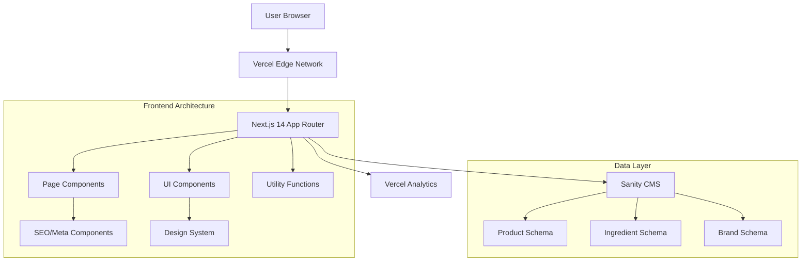

# Design Document

## Overview

サプリメント比較プラットフォーム「サプティア」の技術設計書。Trivagoの情報設計パターン（検索→結果比較→絞り込み→詳細）を踏襲し、Apple/xAIレベルのミニマル＆上質感を実現する。Next.js 14 App Router、TypeScript、Tailwind CSS、Sanityを使用し、Lighthouse モバイル 90+ のパフォーマンスを達成する。

## Architecture

### システム全体構成



### フォルダ構造

```
apps/web/src/
├── app/                          # Next.js 14 App Router
│   ├── (marketing)/             # Marketing pages group
│   │   ├── page.tsx            # Homepage with Hero + Popular + Ingredients
│   │   └── about/              # About pages
│   ├── search/                 # Search results page
│   │   └── page.tsx           # /search?q=...&goal=...&price_min=...
│   ├── ingredients/            # Ingredient detail pages
│   │   └── [slug]/            # /ingredients/vitamin-d
│   ├── products/               # Product detail pages (future)
│   │   └── [slug]/            # /products/product-name
│   ├── globals.css            # Global styles + CSS variables
│   ├── layout.tsx             # Root layout with Header/Footer
│   └── loading.tsx            # Global loading UI
├── components/                 # Reusable UI components
│   ├── ui/                    # Base design system components
│   │   ├── Button.tsx         # Primary/Secondary/Ghost variants
│   │   ├── Card.tsx           # Product/Ingredient card variants
│   │   ├── Badge.tsx          # Ingredient/Effect badges
│   │   ├── Input.tsx          # Search input with suggestions
│   │   ├── Slider.tsx         # Price range slider
│   │   └── Skeleton.tsx       # Loading skeletons
│   ├── layout/                # Layout components
│   │   ├── Header.tsx         # Sticky header with nav
│   │   ├── Footer.tsx         # Footer with links
│   │   └── LangCurrencySwitcher.tsx
│   ├── search/                # Search-related components
│   │   ├── HeroSearch.tsx     # Hero section search form
│   │   ├── SearchBar.tsx      # Reusable search input
│   │   ├── FilterSidebar.tsx  # Search filters
│   │   ├── SortBar.tsx        # Sort controls
│   │   └── ProductCard.tsx    # Search result cards
│   └── sections/              # Page sections
│       ├── PopularComparisons.tsx
│       ├── IngredientGuide.tsx
│       └── CategoryPills.tsx
├── lib/                       # Utility functions and configurations
│   ├── sanity/               # Sanity client and queries
│   │   ├── client.ts         # Sanity client configuration
│   │   ├── queries.ts        # GROQ queries
│   │   └── schemas.ts        # TypeScript types from Sanity
│   ├── search/               # Search logic
│   │   ├── filters.ts        # Filter processing
│   │   ├── sorting.ts        # Sort logic with tiebreakers
│   │   └── suggestions.ts    # Auto-suggest logic
│   ├── utils/                # General utilities
│   │   ├── currency.ts       # Currency formatting and conversion
│   │   ├── url.ts           # URL parameter handling
│   │   └── seo.ts           # SEO utilities and JSON-LD
│   └── constants/            # Application constants
│       ├── design-tokens.ts  # Design system tokens
│       ├── copy.json        # Internationalization content
│       └── config.ts        # App configuration
└── types/                    # TypeScript type definitions
    ├── product.ts           # Product-related types
    ├── search.ts            # Search and filter types
    └── ui.ts               # UI component prop types
```

## Components and Interfaces

### デザインシステム基盤

#### CSS Variables & Tailwind Configuration

```css
/* globals.css */
:root {
  /* Colors */
  --color-bg: #ffffff;
  --color-fg: #0f172a;
  --color-fg-sub: #334155;
  --color-accent: #2563eb;
  --color-border: #e5e7eb;

  /* Spacing Scale */
  --space-2: 8px;
  --space-3: 12px;
  --space-4: 16px;
  --space-6: 24px;
  --space-8: 32px;
  --space-12: 48px;

  /* Shadows */
  --shadow-sm: 0 8px 24px rgba(0, 0, 0, 0.08);
  --shadow-md: 0 12px 28px rgba(0, 0, 0, 0.12);

  /* Typography */
  --font-inter: 'Inter', system-ui, sans-serif;
  --font-noto: 'Noto Sans JP', sans-serif;
}

/* Utility Classes */
.container {
  @apply max-w-[1280px] xl:max-w-[1440px] mx-auto px-6;
}

.card {
  @apply rounded-2xl border border-[var(--color-border)] bg-white shadow-[var(--shadow-sm)] hover:shadow-[var(--shadow-md)] transition-all duration-200 ease-out;
}
```

#### Core UI Components

```typescript
// components/ui/Button.tsx
interface ButtonProps {
  variant: 'primary' | 'secondary' | 'ghost';
  size: 'sm' | 'md' | 'lg';
  children: React.ReactNode;
  onClick?: () => void;
  disabled?: boolean;
}

// components/ui/Card.tsx
interface CardProps {
  variant: 'product' | 'ingredient' | 'category';
  hover?: boolean;
  children: React.ReactNode;
}

// components/ui/Badge.tsx
interface BadgeProps {
  variant: 'ingredient' | 'effect' | 'price' | 'rating';
  size: 'sm' | 'md';
  children: React.ReactNode;
}
```

### レイアウトコンポーネント

#### Header Component

```typescript
// components/layout/Header.tsx
interface HeaderProps {
  transparent?: boolean; // For hero overlay
}

const Header: React.FC<HeaderProps> = ({ transparent = false }) => {
  const [isScrolled, setIsScrolled] = useState(false);

  // Scroll detection for background transition
  useEffect(() => {
    const handleScroll = () => {
      setIsScrolled(window.scrollY > 50);
    };
    window.addEventListener('scroll', handleScroll);
    return () => window.removeEventListener('scroll', handleScroll);
  }, []);

  return (
    <header className={cn(
      "sticky top-0 z-50 transition-all duration-200",
      transparent && !isScrolled
        ? "bg-white/80 backdrop-blur-md"
        : "bg-white border-b border-[var(--color-border)]"
    )}>
      <div className="container flex items-center justify-between h-16">
        <LogoWordmark />
        <nav className="hidden md:flex items-center space-x-8">
          <NavLink href="/about">サプティアとは</NavLink>
          <NavLink href="/ingredients">成分ガイド</NavLink>
          <NavLink href="/compare">比較</NavLink>
        </nav>
        <LangCurrencySwitcher />
      </div>
    </header>
  );
};
```

#### Logo Component

```typescript
// components/layout/LogoWordmark.tsx
const LogoWordmark: React.FC = () => (
  <Link href="/" className="flex items-center space-x-2">
    <div className="text-xl font-light tracking-tight">
      <span className="text-[var(--color-fg)]">サプティア</span>
      <span className="text-[var(--color-fg-sub)] mx-2">|</span>
      <span className="text-[var(--color-accent)]">Suptia</span>
    </div>
  </Link>
);
```

### 検索コンポーネント

#### Hero Search Section

```typescript
// components/search/HeroSearch.tsx
interface HeroSearchProps {
  onSearch: (params: SearchParams) => void;
}

interface SearchParams {
  query: string;
  goals: string[];
  priceMin: number;
  priceMax: number;
}

const HeroSearch: React.FC<HeroSearchProps> = ({ onSearch }) => {
  const [searchParams, setSearchParams] = useState<SearchParams>({
    query: '',
    goals: [],
    priceMin: 0,
    priceMax: 10000
  });

  return (
    <section className="min-h-[100dvh] flex items-center justify-center bg-gradient-to-br from-white to-gray-50">
      <div className="container text-center">
        <h1 className="text-4xl md:text-6xl font-light tracking-tight mb-8">
          最適なサプリメントを
          <br />
          <span className="text-[var(--color-accent)]">科学的に比較</span>
        </h1>

        <div className="max-w-4xl mx-auto">
          <SearchForm
            params={searchParams}
            onChange={setSearchParams}
            onSubmit={() => onSearch(searchParams)}
          />
        </div>

        <ScrollIndicator />
      </div>
    </section>
  );
};
```

#### Search Form Component

```typescript
// components/search/SearchForm.tsx
const SearchForm: React.FC<SearchFormProps> = ({ params, onChange, onSubmit }) => {
  return (
    <div className="card p-6 md:p-8">
      <div className="grid grid-cols-1 md:grid-cols-3 gap-4">
        {/* Free text input */}
        <div className="md:col-span-1">
          <SearchInput
            placeholder="商品名・成分・目的を入力"
            value={params.query}
            onChange={(query) => onChange({ ...params, query })}
            suggestions={useSuggestions(params.query)}
          />
        </div>

        {/* Category/Goal selection */}
        <div className="md:col-span-1">
          <CategorySelect
            selected={params.goals}
            onChange={(goals) => onChange({ ...params, goals })}
            options={GOAL_OPTIONS}
          />
        </div>

        {/* Price range */}
        <div className="md:col-span-1 flex items-center space-x-4">
          <PriceSlider
            min={params.priceMin}
            max={params.priceMax}
            onChange={(priceMin, priceMax) =>
              onChange({ ...params, priceMin, priceMax })
            }
          />
          <Button variant="primary" onClick={onSubmit}>
            検索
          </Button>
        </div>
      </div>
    </div>
  );
};
```

### 検索結果ページコンポーネント

#### Filter Sidebar

```typescript
// components/search/FilterSidebar.tsx
interface FilterSidebarProps {
  filters: SearchFilters;
  onChange: (filters: SearchFilters) => void;
  resultCount: number;
}

interface SearchFilters {
  priceRange: [number, number];
  ingredients: string[];
  goals: string[];
  brands: string[];
  inStock: boolean;
  onSale: boolean;
}

const FilterSidebar: React.FC<FilterSidebarProps> = ({ filters, onChange, resultCount }) => {
  return (
    <aside className="w-80 space-y-6">
      <div className="card p-6">
        <h3 className="font-medium mb-4">絞り込み ({resultCount}件)</h3>

        <FilterGroup title="価格帯">
          <PriceRangeFilter
            value={filters.priceRange}
            onChange={(range) => onChange({ ...filters, priceRange: range })}
          />
        </FilterGroup>

        <FilterGroup title="主要成分">
          <IngredientFilter
            selected={filters.ingredients}
            onChange={(ingredients) => onChange({ ...filters, ingredients })}
          />
        </FilterGroup>

        <FilterGroup title="目的・効果">
          <GoalFilter
            selected={filters.goals}
            onChange={(goals) => onChange({ ...filters, goals })}
          />
        </FilterGroup>

        <FilterGroup title="ブランド">
          <BrandFilter
            selected={filters.brands}
            onChange={(brands) => onChange({ ...filters, brands })}
          />
        </FilterGroup>

        <FilterGroup title="在庫・セール">
          <CheckboxFilter
            options={[
              { key: 'inStock', label: '在庫あり', checked: filters.inStock },
              { key: 'onSale', label: 'セール中', checked: filters.onSale }
            ]}
            onChange={(key, checked) => onChange({ ...filters, [key]: checked })}
          />
        </FilterGroup>
      </div>
    </aside>
  );
};
```

#### Product Card Component

```typescript
// components/search/ProductCard.tsx
interface ProductCardProps {
  product: Product;
  onCompare: (productId: string) => void;
  onViewDetails: (productId: string) => void;
}

const ProductCard: React.FC<ProductCardProps> = ({ product, onCompare, onViewDetails }) => {
  return (
    <div className="card p-6 hover:scale-[1.02] transition-transform">
      <div className="flex space-x-4">
        {/* Product Image */}
        <div className="w-32 h-32 flex-shrink-0">
          <Image
            src={product.image || '/placeholders/product-400x400.jpg'}
            alt={product.name}
            width={128}
            height={128}
            className="rounded-xl object-cover"
          />
        </div>

        {/* Product Info */}
        <div className="flex-1 min-w-0">
          <h3 className="font-medium text-lg mb-2 truncate">{product.name}</h3>
          <p className="text-[var(--color-fg-sub)] text-sm mb-3">{product.brand}</p>

          {/* Ingredient badges */}
          <div className="flex flex-wrap gap-2 mb-3">
            {product.mainIngredients.slice(0, 3).map((ingredient) => (
              <Badge key={ingredient} variant="ingredient" size="sm">
                {ingredient}
              </Badge>
            ))}
          </div>

          {/* Effect badge */}
          {product.primaryEffect && (
            <Badge variant="effect" size="md" className="mb-3">
              {product.primaryEffect}
            </Badge>
          )}

          {/* Rating */}
          <div className="flex items-center space-x-2 mb-3">
            <StarRating rating={product.rating} />
            <span className="text-sm text-[var(--color-fg-sub)]">
              ({product.reviewCount})
            </span>
          </div>
        </div>

        {/* Price & Actions */}
        <div className="flex flex-col items-end justify-between">
          <div className="text-right">
            <div className="text-2xl font-medium text-[var(--color-accent)]">
              ¥{product.lowestPrice.toLocaleString()}
            </div>
            <div className="text-sm text-[var(--color-fg-sub)]">税込・最安値</div>
          </div>

          <div className="space-y-2">
            <Button variant="primary" size="sm" onClick={() => onViewDetails(product.id)}>
              最安値を見る
            </Button>
            <Button variant="secondary" size="sm" onClick={() => onCompare(product.id)}>
              比較に追加
            </Button>
          </div>
        </div>
      </div>

      {/* Expandable specs on hover/focus */}
      <div className="mt-4 pt-4 border-t border-[var(--color-border)] opacity-0 hover:opacity-100 transition-opacity">
        <div className="grid grid-cols-3 gap-4 text-sm">
          <div>
            <span className="text-[var(--color-fg-sub)]">用量:</span>
            <span className="ml-1">{product.dosage}</span>
          </div>
          <div>
            <span className="text-[var(--color-fg-sub)]">形状:</span>
            <span className="ml-1">{product.form}</span>
          </div>
          <div>
            <span className="text-[var(--color-fg-sub)]">容量:</span>
            <span className="ml-1">{product.quantity}</span>
          </div>
        </div>
      </div>
    </div>
  );
};
```

## Data Models

### Sanity Schema Definitions

```typescript
// lib/sanity/schemas.ts

// Product Schema
export interface Product {
  _id: string;
  _type: 'product';
  name: string;
  slug: { current: string };
  brand: {
    _ref: string;
    name: string;
    logo?: string;
  };
  description: string;
  image: string;
  images: string[];

  // Ingredients & Composition
  mainIngredients: string[];
  allIngredients: Ingredient[];
  servingSize: string;
  servingsPerContainer: number;

  // Pricing & Availability
  prices: Price[];
  lowestPrice: number;
  averagePrice: number;

  // Effects & Goals
  primaryEffect: string;
  secondaryEffects: string[];
  targetGoals: string[];

  // Quality & Safety
  rating: number;
  reviewCount: number;
  evidenceLevel: 'A' | 'B' | 'C';
  safetyRating: 'high' | 'medium' | 'low';

  // Physical Properties
  form: 'capsule' | 'tablet' | 'powder' | 'liquid';
  dosage: string;
  quantity: string;

  // SEO & Meta
  seoTitle?: string;
  seoDescription?: string;

  // Timestamps
  createdAt: string;
  updatedAt: string;
}

// Ingredient Schema
export interface Ingredient {
  _id: string;
  _type: 'ingredient';
  name: string;
  slug: { current: string };
  description: string;
  benefits: string[];
  sideEffects: string[];
  recommendedDosage: string;
  evidenceLevel: 'A' | 'B' | 'C';
  safetyNotes: string[];

  // Related data
  relatedProducts: Product[];
  category: string;

  // SEO
  seoTitle?: string;
  seoDescription?: string;
}

// Brand Schema
export interface Brand {
  _id: string;
  _type: 'brand';
  name: string;
  slug: { current: string };
  logo?: string;
  description?: string;
  website?: string;
  country: string;
}

// Price Schema (embedded in Product)
export interface Price {
  store: string;
  storeUrl: string;
  price: number;
  currency: 'JPY' | 'USD';
  inStock: boolean;
  onSale: boolean;
  salePrice?: number;
  lastUpdated: string;
}
```

### Search & Filter Types

```typescript
// types/search.ts

export interface SearchParams {
  query?: string;
  goals?: string[];
  priceMin?: number;
  priceMax?: number;
  sort?: SortOption;
  page?: number;
}

export type SortOption =
  | 'popularity_desc' // Default
  | 'price_asc'
  | 'price_desc'
  | 'rating_desc'
  | 'new_arrivals';

export interface SearchFilters {
  priceRange: [number, number];
  ingredients: string[];
  goals: string[];
  brands: string[];
  inStock: boolean;
  onSale: boolean;
  evidenceLevel: ('A' | 'B' | 'C')[];
  safetyRating: ('high' | 'medium' | 'low')[];
}

export interface SearchResult {
  products: Product[];
  totalCount: number;
  currentPage: number;
  totalPages: number;
  filters: AvailableFilters;
}

export interface AvailableFilters {
  priceRange: [number, number];
  ingredients: FilterOption[];
  goals: FilterOption[];
  brands: FilterOption[];
}

export interface FilterOption {
  value: string;
  label: string;
  count: number;
}
```

## Error Handling

### Error Boundaries

```typescript
// components/ErrorBoundary.tsx
class SearchErrorBoundary extends React.Component<Props, State> {
  constructor(props: Props) {
    super(props);
    this.state = { hasError: false, error: null };
  }

  static getDerivedStateFromError(error: Error): State {
    return { hasError: true, error };
  }

  componentDidCatch(error: Error, errorInfo: React.ErrorInfo) {
    console.error('Search error:', error, errorInfo);
    // Send to monitoring service
  }

  render() {
    if (this.state.hasError) {
      return (
        <div className="card p-8 text-center">
          <h2 className="text-xl font-medium mb-4">検索中にエラーが発生しました</h2>
          <p className="text-[var(--color-fg-sub)] mb-6">
            しばらく時間をおいて再度お試しください。
          </p>
          <Button onClick={() => this.setState({ hasError: false, error: null })}>
            再試行
          </Button>
        </div>
      );
    }

    return this.props.children;
  }
}
```

### API Error Handling

```typescript
// lib/search/api.ts
export async function searchProducts(
  params: SearchParams
): Promise<SearchResult> {
  try {
    const query = buildSearchQuery(params);
    const result = await sanityClient.fetch(query);

    return {
      products: result.products || [],
      totalCount: result.totalCount || 0,
      currentPage: params.page || 1,
      totalPages: Math.ceil((result.totalCount || 0) / 20),
      filters: result.filters || getDefaultFilters(),
    };
  } catch (error) {
    console.error('Search API error:', error);

    // Return empty result with error state
    return {
      products: [],
      totalCount: 0,
      currentPage: 1,
      totalPages: 0,
      filters: getDefaultFilters(),
      error: 'search_failed',
    };
  }
}
```

## Testing Strategy

### Component Testing

```typescript
// components/__tests__/SearchForm.test.tsx
import { render, screen, fireEvent, waitFor } from '@testing-library/react';
import { SearchForm } from '../search/SearchForm';

describe('SearchForm', () => {
  it('should submit search with correct parameters', async () => {
    const mockOnSubmit = jest.fn();

    render(
      <SearchForm
        params={{ query: '', goals: [], priceMin: 0, priceMax: 10000 }}
        onChange={jest.fn()}
        onSubmit={mockOnSubmit}
      />
    );

    // Fill form
    fireEvent.change(screen.getByPlaceholderText('商品名・成分・目的を入力'), {
      target: { value: 'ビタミンD' }
    });

    // Submit
    fireEvent.click(screen.getByText('検索'));

    await waitFor(() => {
      expect(mockOnSubmit).toHaveBeenCalledWith({
        query: 'ビタミンD',
        goals: [],
        priceMin: 0,
        priceMax: 10000
      });
    });
  });

  it('should show suggestions on input focus', async () => {
    render(<SearchForm {...defaultProps} />);

    const input = screen.getByPlaceholderText('商品名・成分・目的を入力');
    fireEvent.focus(input);

    await waitFor(() => {
      expect(screen.getByText('人気の検索')).toBeInTheDocument();
    });
  });
});
```

### E2E Testing

```typescript
// e2e/search-flow.spec.ts
import { test, expect } from '@playwright/test';

test('complete search flow', async ({ page }) => {
  // Navigate to homepage
  await page.goto('/');

  // Verify hero section is visible
  await expect(page.locator('h1')).toContainText('最適なサプリメントを');

  // Perform search
  await page.fill('[placeholder="商品名・成分・目的を入力"]', 'ビタミンD');
  await page.click('button:has-text("検索")');

  // Verify search results page
  await expect(page).toHaveURL(/\/search\?q=ビタミンD/);
  await expect(
    page.locator('[data-testid="product-card"]')
  ).toHaveCount.greaterThan(0);

  // Apply filter
  await page.click('[data-testid="price-filter"]');
  await page.fill('[data-testid="price-max"]', '3000');

  // Verify URL updates
  await expect(page).toHaveURL(/price_max=3000/);

  // Click product card
  await page.click('[data-testid="product-card"]:first-child');

  // Verify navigation to product detail
  await expect(page).toHaveURL(/\/products\//);
});

test('keyboard navigation', async ({ page }) => {
  await page.goto('/');

  // Tab through header navigation
  await page.keyboard.press('Tab'); // Logo
  await page.keyboard.press('Tab'); // Nav item 1
  await page.keyboard.press('Tab'); // Nav item 2
  await page.keyboard.press('Tab'); // Language switcher

  // Tab to search form
  await page.keyboard.press('Tab'); // Search input
  await expect(
    page.locator('[placeholder="商品名・成分・目的を入力"]')
  ).toBeFocused();

  // Type and submit with Enter
  await page.keyboard.type('プロテイン');
  await page.keyboard.press('Enter');

  // Verify search executed
  await expect(page).toHaveURL(/\/search\?q=プロテイン/);
});
```

### Performance Testing

```typescript
// tests/performance.spec.ts
import { test, expect } from '@playwright/test';

test('Core Web Vitals', async ({ page }) => {
  // Navigate to homepage
  await page.goto('/');

  // Measure LCP
  const lcp = await page.evaluate(() => {
    return new Promise(resolve => {
      new PerformanceObserver(list => {
        const entries = list.getEntries();
        const lastEntry = entries[entries.length - 1];
        resolve(lastEntry.startTime);
      }).observe({ entryTypes: ['largest-contentful-paint'] });
    });
  });

  expect(lcp).toBeLessThan(1000); // 1.0s target

  // Measure CLS
  const cls = await page.evaluate(() => {
    return new Promise(resolve => {
      let clsValue = 0;
      new PerformanceObserver(list => {
        for (const entry of list.getEntries()) {
          if (!entry.hadRecentInput) {
            clsValue += entry.value;
          }
        }
        resolve(clsValue);
      }).observe({ entryTypes: ['layout-shift'] });

      setTimeout(() => resolve(clsValue), 5000);
    });
  });

  expect(cls).toBeLessThan(0.02); // 0.02 target
});
```

この設計書では、要件定義で定めた全ての機能要件を技術的に実現するための詳細なアーキテクチャ、コンポーネント設計、データモデル、エラーハンドリング、テスト戦略を定義しています。Next.js 14 App Router、TypeScript、Tailwind CSS、Sanityを使用し、Apple/xAIレベルの品質とTrivagoの情報設計を両立させる実装指針を提供しています。
