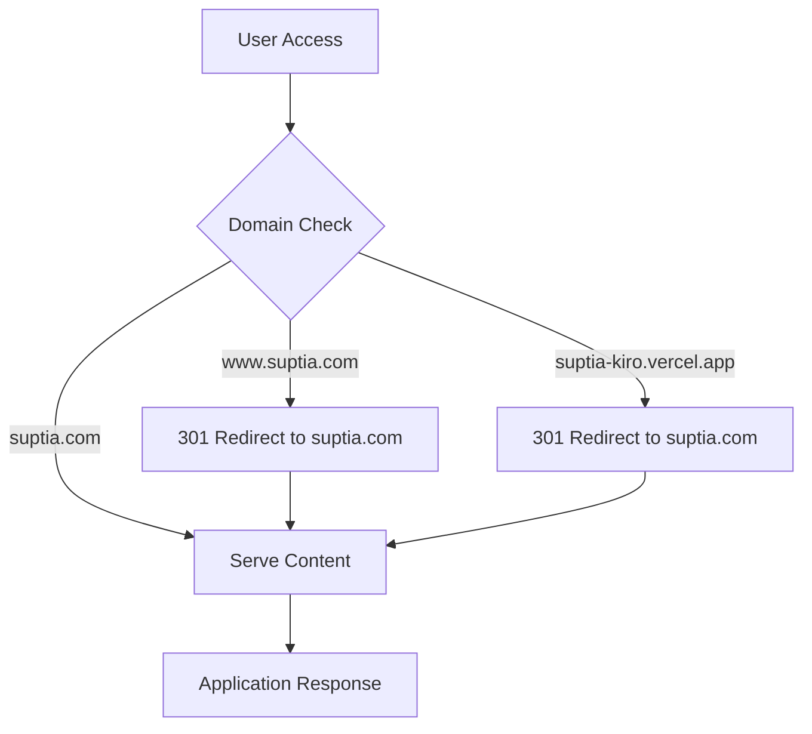
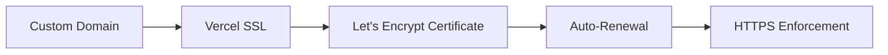

# Design Document

## Overview

サプティアのWebアプリケーションを suptia.com カスタムドメインに移行するための設計です。ドメインとDNS設定は既に完了しているため、Vercelプロジェクトでのドメイン追加、環境変数の更新、リダイレクト設定、および検証機能の実装を行います。

## Architecture

### Domain Migration Flow



### SSL Certificate Management



## Components and Interfaces

### 1. Vercel Domain Configuration

**Purpose**: Vercelプロジェクトにカスタムドメインを追加し、SSL証明書を設定

**Configuration**:
- Primary domain: `suptia.com`
- Redirect domain: `www.suptia.com` → `suptia.com`
- Legacy redirect: `suptia-kiro.vercel.app` → `suptia.com`

### 2. Environment Variables Update

**Purpose**: アプリケーション内で使用されるドメイン関連の環境変数を更新

**Variables to Update**:
```bash
NEXT_PUBLIC_SITE_URL=https://suptia.com
NEXT_PUBLIC_SITE_NAME=サプティア
VERCEL_URL=suptia.com
```

### 3. Application Configuration Updates

**Purpose**: アプリケーションコード内のドメイン参照を更新

**Files to Update**:
- `src/app/sitemap.ts` - サイトマップのベースURL
- `src/lib/seo-config.ts` - SEO設定のcanonical URL
- `src/lib/env-validation.ts` - 環境変数バリデーション
- `vercel.json` - Vercelプロジェクト設定

### 4. Redirect Configuration

**Purpose**: 旧URLから新URLへの適切なリダイレクト設定

**Redirect Rules**:
```json
{
  "redirects": [
    {
      "source": "https://suptia-kiro.vercel.app/:path*",
      "destination": "https://suptia.com/:path*",
      "permanent": true
    },
    {
      "source": "https://www.suptia.com/:path*", 
      "destination": "https://suptia.com/:path*",
      "permanent": true
    }
  ]
}
```

### 5. Domain Verification System

**Purpose**: カスタムドメイン設定の正常性を確認

**Verification Points**:
- DNS resolution check
- SSL certificate validation
- HTTP/HTTPS redirect verification
- Performance metrics collection

## Data Models

### Domain Configuration Model

```typescript
interface DomainConfig {
  primaryDomain: string;
  redirectDomains: string[];
  sslEnabled: boolean;
  httpsRedirect: boolean;
  verificationStatus: 'pending' | 'verified' | 'failed';
}
```

### Health Check Response Model

```typescript
interface DomainHealthCheck {
  domain: string;
  sslValid: boolean;
  sslExpiry: Date;
  dnsResolution: boolean;
  responseTime: number;
  redirectsWorking: boolean;
}
```

## Error Handling

### 1. Domain Resolution Failures

**Scenario**: DNS設定に問題がある場合
**Handling**: 
- Fallback to Vercel default domain
- Error logging and monitoring
- User notification with troubleshooting steps

### 2. SSL Certificate Issues

**Scenario**: SSL証明書の取得や更新に失敗
**Handling**:
- Automatic retry mechanism
- Alert notification to administrators
- Temporary HTTP fallback (development only)

### 3. Redirect Loop Prevention

**Scenario**: 不適切なリダイレクト設定によるループ
**Handling**:
- Redirect chain validation
- Maximum redirect count limit
- Circuit breaker pattern implementation

## Testing Strategy

### 1. Domain Resolution Testing

```bash
# DNS resolution verification
nslookup suptia.com
dig suptia.com

# SSL certificate check
openssl s_client -connect suptia.com:443 -servername suptia.com
```

### 2. Redirect Testing

```bash
# Primary domain access
curl -I https://suptia.com

# WWW redirect test
curl -I https://www.suptia.com

# Legacy domain redirect test
curl -I https://suptia-kiro.vercel.app
```

### 3. Application Functionality Testing

- All pages load correctly on new domain
- API endpoints respond properly
- SEO meta tags contain correct URLs
- Sitemap generates with new domain

### 4. Performance Testing

- Page load speed comparison
- SSL handshake time measurement
- CDN cache effectiveness
- Core Web Vitals metrics

## Security Considerations

### 1. HTTPS Enforcement

- Force HTTPS redirect for all HTTP requests
- HSTS header implementation
- Secure cookie settings update

### 2. Domain Validation

- Verify domain ownership before configuration
- Prevent subdomain takeover attacks
- Monitor for unauthorized domain changes

### 3. Certificate Management

- Automatic certificate renewal
- Certificate transparency monitoring
- Backup certificate storage

## Monitoring and Alerting

### 1. Domain Health Monitoring

- Continuous uptime monitoring
- SSL certificate expiry alerts
- DNS resolution monitoring
- Performance degradation alerts

### 2. Traffic Analysis

- Domain traffic distribution
- Redirect success rates
- Error rate monitoring
- User experience metrics

## Migration Timeline

### Phase 1: Preparation (5 minutes)
- Update environment variables
- Modify application configuration
- Test changes locally

### Phase 2: Domain Addition (10 minutes)
- Add custom domain to Vercel project
- Configure SSL certificate
- Set up redirect rules

### Phase 3: Verification (15 minutes)
- DNS propagation check
- SSL certificate validation
- Redirect functionality test
- Application functionality verification

### Phase 4: Monitoring (Ongoing)
- Performance monitoring setup
- Error tracking configuration
- User feedback collection

## Rollback Plan

### Immediate Rollback
1. Remove custom domain from Vercel
2. Revert environment variables
3. Update DNS to point back to original

### Gradual Rollback
1. Implement traffic splitting
2. Monitor error rates
3. Gradually shift traffic back if needed

## Success Metrics

- **Domain Resolution**: 100% success rate
- **SSL Certificate**: Valid and trusted
- **Redirect Success**: >99% success rate
- **Page Load Time**: <2 seconds
- **SEO Impact**: No ranking drops
- **User Experience**: No increase in bounce rate