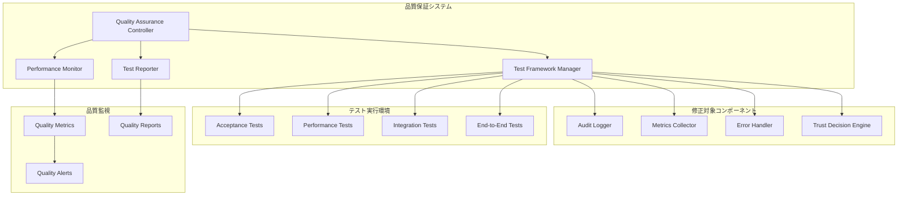

# Design Document

## Overview

システム品質保証機能は、現在発生している品質問題を解決し、継続的な品質監視体制を構築します。主な問題は以下の通りです：

1. **AuditLoggerクラスの不完全な実装** - `initialize`メソッドが存在しない
2. **パフォーマンステストの実行エラー** - モジュールインポートの問題
3. **受け入れテストの失敗** - 初期化処理の不備
4. **テスト環境の不安定性** - 依存関係の問題

これらの問題を解決し、堅牢な品質保証システムを構築します。

## Architecture

### システム構成図



## Components and Interfaces

### 1. Quality Assurance Controller

品質保証プロセス全体を統括するコントローラー。

```typescript
interface QualityAssuranceController {
  // 品質チェックの実行
  runQualityCheck(): Promise<QualityCheckResult>;
  
  // 問題の自動修正
  autoFixIssues(issues: QualityIssue[]): Promise<FixResult[]>;
  
  // 品質レポートの生成
  generateQualityReport(): Promise<QualityReport>;
  
  // デプロイ可能性の判定
  assessDeploymentReadiness(): Promise<DeploymentReadiness>;
}
```

### 2. Test Framework Manager

テスト実行環境の管理と修正。

```typescript
interface TestFrameworkManager {
  // テスト環境の初期化
  initializeTestEnvironment(): Promise<void>;
  
  // 不足しているメソッドの追加
  addMissingMethods(): Promise<void>;
  
  // テスト依存関係の解決
  resolveDependencies(): Promise<void>;
  
  // テストの実行
  runTests(testType: TestType): Promise<TestResult>;
}
```

### 3. Performance Monitor

パフォーマンステストの修正と監視。

```typescript
interface PerformanceMonitor {
  // パフォーマンステストの修正
  fixPerformanceTests(): Promise<void>;
  
  // パフォーマンス測定
  measurePerformance(operation: Operation): Promise<PerformanceMetrics>;
  
  // パフォーマンス閾値の監視
  monitorThresholds(): Promise<ThresholdStatus>;
  
  // パフォーマンスレポートの生成
  generatePerformanceReport(): Promise<PerformanceReport>;
}
```

### 4. Component Fixer

不完全なコンポーネントの修正。

```typescript
interface ComponentFixer {
  // AuditLoggerの修正
  fixAuditLogger(): Promise<void>;
  
  // MetricsCollectorの修正
  fixMetricsCollector(): Promise<void>;
  
  // ErrorHandlerの修正
  fixErrorHandler(): Promise<void>;
  
  // 修正結果の検証
  validateFixes(): Promise<ValidationResult>;
}
```

## Data Models

### Quality Check Result

```typescript
interface QualityCheckResult {
  overall: 'pass' | 'fail' | 'warning';
  categories: {
    [category: string]: CategoryResult;
  };
  issues: QualityIssue[];
  recommendations: string[];
  deploymentReady: boolean;
}

interface CategoryResult {
  status: 'pass' | 'fail' | 'warning';
  passed: number;
  failed: number;
  warnings: number;
  details: TestDetail[];
}

interface QualityIssue {
  id: string;
  category: string;
  severity: 'critical' | 'major' | 'minor';
  description: string;
  solution: string;
  autoFixable: boolean;
}
```

### Performance Metrics

```typescript
interface PerformanceMetrics {
  operationType: string;
  executionTime: number;
  memoryUsage: number;
  cpuUsage: number;
  timestamp: Date;
  threshold: {
    executionTime: number;
    memoryUsage: number;
  };
  status: 'pass' | 'fail' | 'warning';
}
```

### Test Result

```typescript
interface TestResult {
  testType: TestType;
  status: 'pass' | 'fail';
  totalTests: number;
  passedTests: number;
  failedTests: number;
  duration: number;
  errors: TestError[];
  coverage?: CoverageReport;
}

interface TestError {
  testName: string;
  error: string;
  stackTrace: string;
  suggestion: string;
}
```

## Error Handling

### 1. 段階的エラー処理

```typescript
class QualityAssuranceErrorHandler {
  async handleError(error: QualityError): Promise<ErrorHandlingResult> {
    // 1. エラーの分類
    const category = this.categorizeError(error);
    
    // 2. 自動修正の試行
    if (category.autoFixable) {
      const fixResult = await this.attemptAutoFix(error);
      if (fixResult.success) {
        return { status: 'fixed', result: fixResult };
      }
    }
    
    // 3. 手動修正の提案
    const suggestions = this.generateSuggestions(error);
    return { status: 'manual_fix_required', suggestions };
  }
}
```

### 2. エラー回復戦略

- **Critical Errors**: 即座に処理を停止し、詳細な診断情報を提供
- **Major Errors**: 代替手段を試行し、警告を発行
- **Minor Errors**: ログに記録し、処理を継続

## Testing Strategy

### 1. 修正対象の特定

```typescript
interface FixTarget {
  component: string;
  issue: string;
  priority: 'high' | 'medium' | 'low';
  estimatedEffort: number;
  dependencies: string[];
}

const fixTargets: FixTarget[] = [
  {
    component: 'AuditLogger',
    issue: 'Missing initialize method',
    priority: 'high',
    estimatedEffort: 2,
    dependencies: []
  },
  {
    component: 'MetricsCollector',
    issue: 'Missing initialize method',
    priority: 'high',
    estimatedEffort: 2,
    dependencies: []
  },
  {
    component: 'ErrorHandler',
    issue: 'Missing initialize method',
    priority: 'high',
    estimatedEffort: 2,
    dependencies: []
  },
  {
    component: 'PerformanceTest',
    issue: 'Module import error',
    priority: 'high',
    estimatedEffort: 3,
    dependencies: ['AuditLogger', 'MetricsCollector']
  }
];
```

### 2. テスト修正戦略

#### Phase 1: コンポーネント修正
1. **AuditLogger.initialize()** メソッドの実装
2. **MetricsCollector.initialize()** メソッドの実装
3. **ErrorHandler.initialize()** メソッドの実装

#### Phase 2: テスト環境修正
1. **モジュールインポート** の修正
2. **テストデータ準備** の改善
3. **テスト実行環境** の安定化

#### Phase 3: パフォーマンステスト修正
1. **動的インポート** の修正
2. **パフォーマンス測定** の改善
3. **閾値設定** の最適化

### 3. 品質保証テスト

```typescript
interface QualityAssuranceTest {
  name: string;
  description: string;
  testFunction: () => Promise<TestResult>;
  expectedResult: TestResult;
  timeout: number;
}

const qualityTests: QualityAssuranceTest[] = [
  {
    name: 'Component Initialization',
    description: 'All components can be initialized successfully',
    testFunction: async () => {
      // 全コンポーネントの初期化テスト
    },
    expectedResult: { status: 'pass', errors: [] },
    timeout: 30000
  },
  {
    name: 'Performance Threshold',
    description: 'All operations complete within performance thresholds',
    testFunction: async () => {
      // パフォーマンス閾値テスト
    },
    expectedResult: { status: 'pass', averageTime: '<100ms' },
    timeout: 60000
  }
];
```

## Implementation Phases

### Phase 1: 緊急修正 (Priority: Critical)
- AuditLogger, MetricsCollector, ErrorHandlerの`initialize`メソッド実装
- 受け入れテストの即座修正
- 基本的な品質チェックの復旧

### Phase 2: パフォーマンス修正 (Priority: High)
- パフォーマンステストのモジュールインポート修正
- 動的インポートの実装
- パフォーマンス測定の改善

### Phase 3: 品質監視強化 (Priority: Medium)
- 継続的品質監視の実装
- 品質メトリクスの収集
- 自動アラート機能

### Phase 4: 運用最適化 (Priority: Low)
- 品質レポートの改善
- デプロイメント自動化
- 長期品質トレンド分析

## Quality Gates

### デプロイメント品質ゲート

```typescript
interface QualityGate {
  name: string;
  criteria: QualityCriteria[];
  blocking: boolean;
}

const deploymentGates: QualityGate[] = [
  {
    name: 'Critical Functionality',
    criteria: [
      { metric: 'acceptance_test_pass_rate', threshold: 100, operator: '==' },
      { metric: 'component_initialization_success', threshold: 100, operator: '==' }
    ],
    blocking: true
  },
  {
    name: 'Performance Standards',
    criteria: [
      { metric: 'average_decision_time', threshold: 100, operator: '<=' },
      { metric: 'memory_usage', threshold: 512, operator: '<=' }
    ],
    blocking: true
  },
  {
    name: 'Quality Metrics',
    criteria: [
      { metric: 'code_coverage', threshold: 80, operator: '>=' },
      { metric: 'test_success_rate', threshold: 95, operator: '>=' }
    ],
    blocking: false
  }
];
```

## Monitoring and Alerting

### 品質監視ダッシュボード

```typescript
interface QualityDashboard {
  // リアルタイム品質メトリクス
  realTimeMetrics: QualityMetrics;
  
  // 品質トレンド
  qualityTrends: QualityTrend[];
  
  // アクティブアラート
  activeAlerts: QualityAlert[];
  
  // 推奨アクション
  recommendedActions: RecommendedAction[];
}
```

### アラート設定

- **Critical**: 受け入れテスト失敗、パフォーマンス閾値超過
- **Warning**: 品質メトリクス低下、テスト成功率低下
- **Info**: 品質改善の機会、最適化提案

## Security Considerations

### 品質保証セキュリティ

1. **テストデータの保護**: 機密情報を含まないテストデータの使用
2. **テスト環境の分離**: 本番環境への影響を防ぐ完全な分離
3. **品質レポートのアクセス制御**: 適切な権限管理
4. **自動修正の制限**: 安全な修正のみを自動実行

## Performance Optimization

### 品質チェックの最適化

1. **並行実行**: 独立したテストの並行実行
2. **キャッシュ活用**: テスト結果のキャッシュ
3. **段階的実行**: 失敗時の早期終了
4. **リソース管理**: メモリ・CPU使用量の最適化