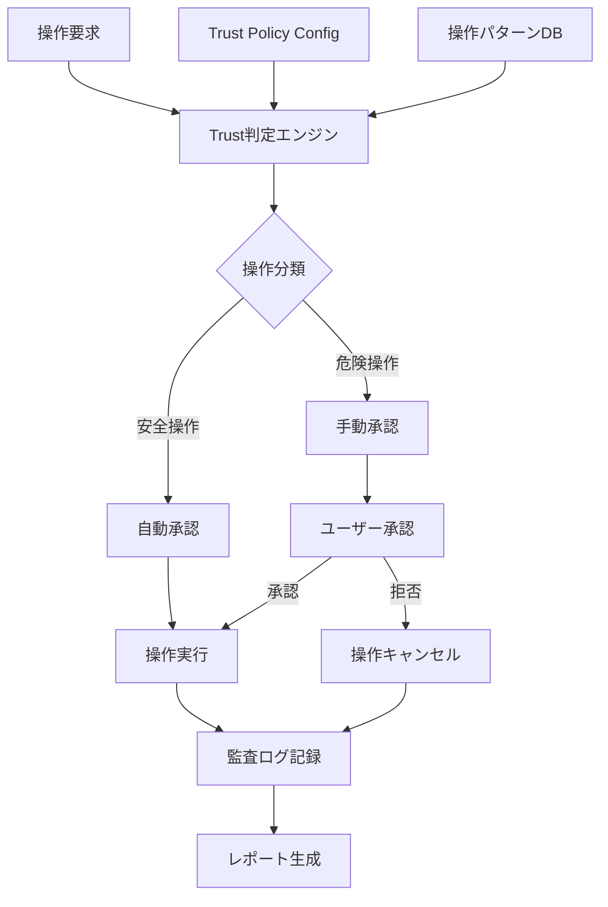

# Design Document

## Overview

MCP以外のTrust承認「最大効率版」は、個人開発における作業効率を最大化するため、危険操作のみ手動承認とし、その他すべての操作を自動承認するシステムです。95%以上の操作でTrustダイアログを表示せず、完全自動実行を実現しながら、本番環境への影響を適切に制御します。

## Architecture

### システム構成図



### コンポーネント階層

```
Trust承認システム
├── Trust判定エンジン
│   ├── 操作分類器
│   ├── ポリシー評価器
│   └── セキュリティ検証器
├── 設定管理
│   ├── ポリシー設定
│   ├── 設定検証
│   └── デフォルト設定
├── 監査システム
│   ├── ログ記録
│   ├── ログローテーション
│   └── レポート生成
└── 運用支援
    ├── ガイドライン管理
    ├── トラブルシューティング
    └── メトリクス収集
```

## Components and Interfaces

### 1. Trust判定エンジン (`TrustDecisionEngine`)

**責任**: 操作要求を受け取り、自動承認・手動承認の判定を行う

**インターフェース**:
```typescript
interface TrustDecisionEngine {
  evaluateOperation(operation: Operation): TrustDecision;
  updatePolicy(policy: TrustPolicy): void;
  getOperationHistory(): OperationLog[];
}

interface Operation {
  type: OperationType;
  command: string;
  args: string[];
  context: OperationContext;
  timestamp: Date;
}

interface TrustDecision {
  approved: boolean;
  requiresManualApproval: boolean;
  reason: string;
  riskLevel: RiskLevel;
}
```

### 2. 操作分類器 (`OperationClassifier`)

**責任**: 操作を安全・危険に分類し、適切なカテゴリに振り分ける

**分類ルール**:
- **自動承認対象**:
  - Git通常操作: `git status`, `git commit`, `git push`, `git pull`, `git merge`, `git log`
  - ローカルファイル操作: ファイル作成・更新、レポート生成
  - Vercel CLI読み取り: `vercel env ls`, `vercel domains ls`, `vercel deployments ls`, `vercel status`
  - スクリプト実行: `*.mjs`ファイルの実行（レポート生成・診断系）

- **手動承認対象**:
  - 削除系操作: `git branch -D`, `git push --delete`, `rm`, `vercel env rm`, `vercel domain rm`
  - 強制系操作: `git reset --hard`, `git push --force`
  - 本番環境影響: GitHub/Sanity-dev MCPのwrite系、Vercel envSet/domain add/remove

### 3. ポリシー設定管理 (`PolicyManager`)

**責任**: Trust承認ポリシーの設定・検証・更新を管理

**設定ファイル構造** (`.kiro/settings/trust-policy.json`):
```json
{
  "version": "1.0",
  "lastUpdated": "2025-08-27T10:00:00Z",
  "autoApprove": {
    "gitOperations": [
      "status", "commit", "push", "pull", "merge", "log", 
      "diff", "show", "branch", "checkout", "switch"
    ],
    "fileOperations": [
      "read", "write", "create", "update", "mkdir"
    ],
    "cliOperations": {
      "vercel": ["env ls", "domains ls", "deployments ls", "status", "whoami"]
    },
    "scriptExecution": {
      "extensions": [".mjs"],
      "allowedPaths": ["scripts/", ".kiro/scripts/"]
    }
  },
  "manualApprove": {
    "deleteOperations": [
      "git branch -D", "git push --delete", "rm -rf", "vercel env rm", "vercel domain rm"
    ],
    "forceOperations": [
      "git reset --hard", "git push --force", "git push -f"
    ],
    "productionImpact": [
      "github:write", "sanity-dev:write", "vercel:envSet", "vercel:addDomain"
    ]
  },
  "security": {
    "maxAutoApprovalPerHour": 1000,
    "suspiciousPatternDetection": true,
    "logAllOperations": true
  }
}
```

### 4. 監査ログシステム (`AuditLogger`)

**責任**: すべての操作の監査ログを記録・管理

**ログ形式**:
```typescript
interface AuditLog {
  id: string;
  timestamp: Date;
  operation: Operation;
  decision: TrustDecision;
  executionResult: ExecutionResult;
  user: string;
  sessionId: string;
}
```

**ログファイル構造**:
- 自動承認ログ: `.kiro/reports/auto-trust-log-YYYY-MM-DD.md`
- 手動承認ログ: `.kiro/reports/manual-trust-log-YYYY-MM-DD.md`
- エラーログ: `.kiro/reports/trust-error-log-YYYY-MM-DD.md`

### 5. レポート生成システム (`ReportGenerator`)

**責任**: Trust承認システムの運用状況レポートを生成

**レポート種類**:
- **ポリシー更新レポート**: 設定変更の詳細と影響分析
- **運用メトリクスレポート**: 自動承認率、手動承認頻度、エラー率
- **セキュリティレポート**: 不審な操作パターン、セキュリティイベント

## Data Models

### Trust Policy Model

```typescript
interface TrustPolicy {
  version: string;
  lastUpdated: Date;
  autoApprove: AutoApproveConfig;
  manualApprove: ManualApproveConfig;
  security: SecurityConfig;
}

interface AutoApproveConfig {
  gitOperations: string[];
  fileOperations: string[];
  cliOperations: Record<string, string[]>;
  scriptExecution: ScriptConfig;
}

interface ManualApproveConfig {
  deleteOperations: string[];
  forceOperations: string[];
  productionImpact: string[];
}

interface SecurityConfig {
  maxAutoApprovalPerHour: number;
  suspiciousPatternDetection: boolean;
  logAllOperations: boolean;
}
```

### Operation Log Model

```typescript
interface OperationLog {
  id: string;
  timestamp: Date;
  operationType: OperationType;
  command: string;
  args: string[];
  approved: boolean;
  approvalType: 'auto' | 'manual';
  executionTime: number;
  result: 'success' | 'failure' | 'cancelled';
  errorMessage?: string;
}
```

## Error Handling

### エラー分類と対応

1. **設定エラー**:
   - 不正なポリシー設定 → デフォルト設定に戻し、エラーログ記録
   - 設定ファイル破損 → バックアップから復元、手動確認要求

2. **判定エラー**:
   - 操作分類失敗 → 安全側（手動承認）に倒し、ログ記録
   - ポリシー評価エラー → デフォルトポリシーで再評価

3. **実行エラー**:
   - ログ記録失敗 → 標準出力にエラー表示、操作は継続
   - レポート生成失敗 → エラーログ記録、手動生成を促す

### フォールバック戦略

```typescript
class TrustDecisionEngine {
  private fallbackToSafeMode(error: Error): TrustDecision {
    this.logger.error('Trust decision failed, falling back to safe mode', error);
    return {
      approved: false,
      requiresManualApproval: true,
      reason: 'System error - manual approval required for safety',
      riskLevel: RiskLevel.HIGH
    };
  }
}
```

## Testing Strategy

### 単体テスト

1. **操作分類テスト**:
   - 各操作タイプの正確な分類
   - エッジケースの処理
   - 不正な操作の検出

2. **ポリシー評価テスト**:
   - 設定ファイルの読み込み・検証
   - ポリシールールの適用
   - デフォルト設定の動作

3. **ログ記録テスト**:
   - ログフォーマットの正確性
   - ファイルローテーション
   - エラー時の動作

### 統合テスト

1. **エンドツーエンドフロー**:
   - 操作要求から実行完了までの全フロー
   - 自動承認・手動承認の両パターン
   - エラー発生時の復旧

2. **パフォーマンステスト**:
   - 判定処理の応答時間（100ms以内）
   - 高負荷時の動作
   - メモリ使用量の監視

### 受け入れテスト

1. **効率性テスト**:
   - 95%以上の操作が自動承認されることの確認
   - Trustダイアログの表示頻度測定
   - 開発フローの中断頻度測定

2. **セキュリティテスト**:
   - 危険操作の確実な検出
   - 不正操作の防止
   - 監査ログの完全性

## Performance Considerations

### 最適化戦略

1. **判定処理の高速化**:
   - 操作パターンのキャッシュ化
   - 頻繁な操作の事前計算
   - 並列処理の活用

2. **メモリ効率化**:
   - ログの適切なローテーション
   - 不要なデータの定期削除
   - メモリリークの防止

3. **I/O最適化**:
   - 設定ファイルの非同期読み込み
   - ログの非同期書き込み
   - バッチ処理の活用

### 監視メトリクス

- 判定処理時間（目標: 100ms以内）
- 自動承認率（目標: 95%以上）
- メモリ使用量
- ログファイルサイズ
- エラー発生率

## Security Considerations

### セキュリティ対策

1. **設定ファイル保護**:
   - ファイル権限の適切な設定
   - 改ざん検出機能
   - バックアップとリストア機能

2. **操作検証**:
   - 不審なパターンの検出
   - 異常な頻度の操作監視
   - 外部からの不正要求の防止

3. **監査証跡**:
   - すべての操作の完全なログ記録
   - ログの改ざん防止
   - 長期保存とアーカイブ

### 脅威モデル

1. **内部脅威**:
   - 設定ファイルの不正変更
   - ログの削除・改ざん
   - 対策: ファイル権限、整合性チェック

2. **外部脅威**:
   - 不正な操作要求
   - システムの悪用
   - 対策: 入力検証、レート制限

## Deployment Strategy

### 段階的展開

1. **Phase 1**: 基本機能の実装とテスト
2. **Phase 2**: 監査ログとレポート機能
3. **Phase 3**: セキュリティ強化と最適化
4. **Phase 4**: 運用ガイドラインと文書化

### 設定移行

既存のMCP設定との共存を考慮し、段階的に移行:
1. デフォルト設定での動作確認
2. 個別操作の設定調整
3. 全体最適化と微調整