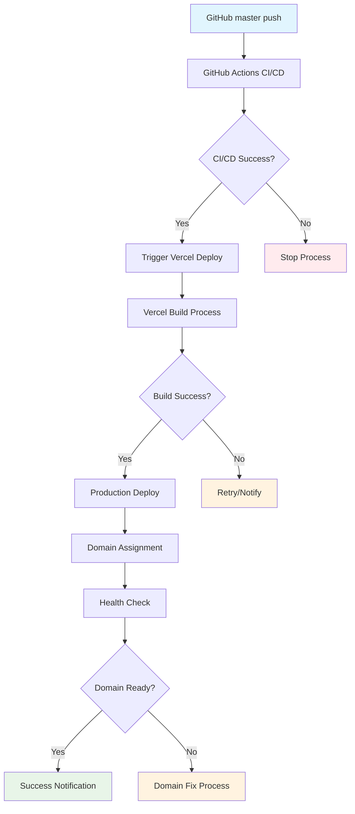

# Design Document

## Overview

Vercel Production デプロイの問題を解決するため、GitHub-Vercel 連携の最適化、monorepo 対応の改善、および監視システムの構築を行う。根本原因の分析に基づき、確実なデプロイメントフローを設計する。

## Architecture

### 根本原因分析

#### 1. Vercel Git 連携の問題
- **問題**: masterブランチプッシュ時にProductionデプロイが作成されない
- **原因**: Vercel の Git 連携設定またはブランチ設定の不整合
- **影響**: Production環境が更新されず、カスタムドメインが404エラー

#### 2. Monorepo ビルド設定の問題  
- **問題**: vercel.json の buildCommand が正しく実行されない可能性
- **原因**: pnpm workspaces とVercelの相性問題
- **影響**: ビルド失敗またはデプロイ対象の誤認識

#### 3. 環境変数の問題
- **問題**: NEXT_PUBLIC_SANITY_PROJECT_ID 等の環境変数が未設定
- **原因**: Vercel Secrets の設定不備
- **影響**: ビルド時エラーまたはランタイムエラー

#### 4. ドメイン設定の問題
- **問題**: suptia.com が Production デプロイに正しく紐付けられない
- **原因**: 直近のProductionデプロイが存在しないため
- **影響**: カスタムドメインアクセス時の404エラー

### 解決アプローチ



## Components and Interfaces

### 1. Vercel Configuration Optimization

#### vercel.json 改善
```json
{
  "version": 2,
  "buildCommand": "pnpm install --frozen-lockfile && pnpm --filter @suptia/web build",
  "installCommand": "pnpm install --frozen-lockfile",
  "outputDirectory": "apps/web/.next",
  "framework": "nextjs",
  "functions": {
    "apps/web/pages/api/**/*.js": {
      "runtime": "nodejs18.x"
    }
  },
  "env": {
    "NEXT_PUBLIC_SANITY_PROJECT_ID": "@next_public_sanity_project_id",
    "NEXT_PUBLIC_SANITY_DATASET": "@next_public_sanity_dataset", 
    "NEXT_PUBLIC_SITE_URL": "@next_public_site_url",
    "SANITY_API_VERSION": "@sanity_api_version"
  },
  "build": {
    "env": {
      "NEXT_PUBLIC_SANITY_PROJECT_ID": "@next_public_sanity_project_id",
      "NEXT_PUBLIC_SANITY_DATASET": "@next_public_sanity_dataset",
      "NEXT_PUBLIC_SITE_URL": "@next_public_site_url", 
      "SANITY_API_VERSION": "@sanity_api_version"
    }
  }
}
```

#### 改善点
- `buildCommand` に `pnpm install` を明示的に追加
- `functions` 設定でAPI routes の runtime を指定
- `build.env` でビルド時環境変数を明示的に設定

### 2. GitHub Actions Vercel Integration

#### Production Deploy Workflow
```yaml
name: Vercel Production Deploy

on:
  push:
    branches: [master]
  workflow_dispatch:

jobs:
  deploy:
    name: Deploy to Vercel Production
    runs-on: ubuntu-latest
    steps:
      - name: Checkout
        uses: actions/checkout@v4
        
      - name: Deploy to Vercel
        uses: amondnet/vercel-action@v25
        with:
          vercel-token: ${{ secrets.VERCEL_TOKEN }}
          vercel-org-id: ${{ secrets.VERCEL_ORG_ID }}
          vercel-project-id: ${{ secrets.VERCEL_PROJECT_ID }}
          vercel-args: '--prod'
          
      - name: Wait for Deployment
        run: |
          sleep 60
          
      - name: Verify Production Deployment
        env:
          VERCEL_TOKEN: ${{ secrets.VERCEL_TOKEN }}
          VERCEL_PROJECT_ID: ${{ secrets.VERCEL_PROJECT_ID }}
        run: |
          node scripts/verify-production-deployment.mjs
          
      - name: Test Custom Domain
        run: |
          curl -f https://www.suptia.com || exit 1
```

### 3. Vercel API Integration Scripts

#### Production Deployment Verification
```javascript
// scripts/verify-production-deployment.mjs
export async function verifyProductionDeployment() {
  const response = await fetch(`https://api.vercel.com/v6/deployments`, {
    headers: {
      'Authorization': `Bearer ${process.env.VERCEL_TOKEN}`
    }
  });
  
  const deployments = await response.json();
  const productionDeploys = deployments.deployments.filter(d => 
    d.target === 'production' && 
    d.projectId === process.env.VERCEL_PROJECT_ID
  );
  
  if (productionDeploys.length === 0) {
    throw new Error('No production deployments found');
  }
  
  const latest = productionDeploys[0];
  if (latest.state !== 'READY') {
    throw new Error(`Latest deployment state: ${latest.state}`);
  }
  
  return latest;
}
```

### 4. Domain Health Check System

#### Custom Domain Verification
```javascript
// scripts/verify-custom-domain.mjs
export async function verifyCustomDomain(domain = 'suptia.com') {
  // 1. HTTP Status Check
  const response = await fetch(`https://${domain}`);
  if (!response.ok) {
    throw new Error(`Domain ${domain} returned ${response.status}`);
  }
  
  // 2. Vercel Headers Check
  const vercelId = response.headers.get('x-vercel-id');
  if (!vercelId || vercelId === 'DEPLOYMENT_NOT_FOUND') {
    throw new Error(`Invalid x-vercel-id: ${vercelId}`);
  }
  
  // 3. Content Verification
  const html = await response.text();
  if (!html.includes('Suptia')) {
    throw new Error('Expected content not found');
  }
  
  return { status: 'OK', vercelId, domain };
}
```

## Data Models

### Deployment Status Model
```typescript
interface DeploymentStatus {
  id: string;
  url: string;
  state: 'BUILDING' | 'READY' | 'ERROR' | 'CANCELED';
  target: 'production' | 'preview';
  createdAt: string;
  readyAt?: string;
  gitSource: {
    type: 'github';
    repo: string;
    ref: string;
    sha: string;
  };
}

interface DomainStatus {
  domain: string;
  verified: boolean;
  vercelId: string;
  lastChecked: string;
  status: 'READY' | 'ERROR' | 'PENDING';
}
```

## Error Handling

### 1. Deployment Failure Handling
- **自動リトライ**: 3回まで自動リトライ実行
- **エラー通知**: GitHub Issues 自動作成
- **ロールバック**: 前回成功デプロイへの自動復旧

### 2. Domain Issue Handling  
- **DNS確認**: ドメイン設定の自動診断
- **SSL証明書**: 証明書ステータスの確認
- **キャッシュクリア**: CDNキャッシュの強制更新

### 3. Build Issue Handling
- **依存関係**: pnpm install の詳細ログ
- **環境変数**: 必要な変数の存在確認
- **ビルドログ**: 詳細なエラー情報の収集

## Testing Strategy

### 1. Integration Tests
- GitHub Actions → Vercel デプロイフロー
- カスタムドメインアクセステスト
- 環境変数設定テスト

### 2. Monitoring Tests
- デプロイ状況の定期監視
- ドメインヘルスチェック
- パフォーマンス監視

### 3. Recovery Tests
- 失敗時の自動復旧テスト
- ロールバック機能テスト
- 通知システムテスト

## Security Considerations

### 1. Secrets Management
- Vercel Token の適切な管理
- 環境変数の暗号化
- アクセス権限の最小化

### 2. Domain Security
- SSL/TLS 証明書の自動更新
- セキュリティヘッダーの設定
- CORS ポリシーの適用

### 3. Deployment Security
- ビルド時の依存関係検証
- 本番環境への安全なデプロイ
- 機密情報の漏洩防止