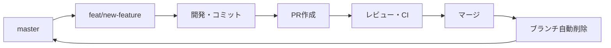

# Git Workflow Guide

## 🎯 基本原則: Master一本化

このリポジトリは **master一本化** の運用ルールに従います。

### ✅ 運用ルール

1. **本番ブランチ**: `master` のみ
2. **作業ブランチ**: `feat/`, `chore/`, `fix/` などの標準パターン
3. **自動クリーンアップ**: PRマージ後、作業ブランチは自動削除

## 🔄 開発フロー



### 1. 作業開始
```bash
# masterから最新を取得
git switch master
git pull origin master

# 作業ブランチを作成
git switch -c feat/your-feature-name
```

### 2. 開発・コミット
```bash
# 開発作業
# ...

# コミット（軽量チェックのみ）
git add .
git commit -m "feat: implement your feature"

# 緊急時の回避オプション
# HUSKY=0 git commit -m "feat: implement your feature"
# git commit --no-verify -m "feat: implement your feature"

git push origin feat/your-feature-name
```

**💡 コミット方針**:
- **ローカル**: format + lint-staged のみ（高速）
- **CI**: test, typecheck, build, compliance（品質担保）

### 3. PR作成・マージ
1. GitHub でPRを作成
2. レビュー・CI通過を待つ
3. マージ実行
4. **作業ブランチは自動削除される**

## 🧹 自動クリーンアップシステム

### Auto Branch Cleanup
- **対象**: すべての標準作業ブランチ
- **トリガー**: PRマージ時
- **動作**: 自動的にブランチ削除・リファレンス整理

### 対象ブランチパターン
- `feat/*` - 新機能
- `chore/*` - 雑務・メンテナンス  
- `fix/*` - バグ修正
- `hotfix/*` - 緊急修正
- `docs/*` - ドキュメント
- `style/*` - スタイル修正
- `refactor/*` - リファクタリング
- `perf/*` - パフォーマンス改善
- `test/*` - テスト
- `build/*` - ビルド設定
- `ci/*` - CI設定

## 📊 期待される状態

### ✅ 理想的なリポジトリ
```bash
# リモートブランチ確認
git ls-remote --heads origin
# → master のみ表示される

# ローカルブランチ確認  
git branch -a
# → master + 現在作業中のブランチのみ
```

### ❌ 避けるべき状態
- 古い作業ブランチの残存
- masterへの直接プッシュ
- 命名規則に従わないブランチ

## 🛠️ トラブルシューティング

### 作業ブランチが残っている場合

1. **自動削除の確認**
   - GitHub Actions の `Auto Branch Cleanup` ログを確認
   - `.kiro/reports/` の実行レポートを確認

2. **手動削除**
   ```bash
   # リモートブランチ削除
   git push origin --delete branch-name
   
   # ローカルクリーンアップ
   git branch -D branch-name
   git fetch --prune
   ```

### 緊急時の対応

1. **Hotfix作成**
   ```bash
   git switch master
   git pull origin master
   git switch -c hotfix/urgent-fix
   # 修正作業
   # 緊急PRでマージ
   ```

2. **Master保護**
   - masterに問題がある場合は開発停止
   - 安定版から復旧作業

## 🔧 設定確認

### GitHub設定
- [x] Branch protection rules (master)
- [x] Require PR reviews  
- [x] Require status checks
- [x] Auto-delete head branches

### ワークフロー
- [x] Auto Branch Cleanup enabled
- [x] CI workflows configured

## 💡 利点

### 開発効率
- **シンプル**: 覚えやすいブランチ戦略
- **自動化**: メンテナンス不要
- **クリーン**: 常に整理された状態

### 品質保証  
- **保護**: masterブランチの品質保証
- **ゲート**: 必須チェックによる品質管理
- **追跡**: 明確な変更履歴

### 運用安定性
- **一対一**: 本番環境との対応
- **予測可能**: 安定したデプロイフロー  
- **明確**: 緊急時の対応手順

---

**🎉 このワークフローにより、常にクリーンで安全なmasterブランチが維持されます！**