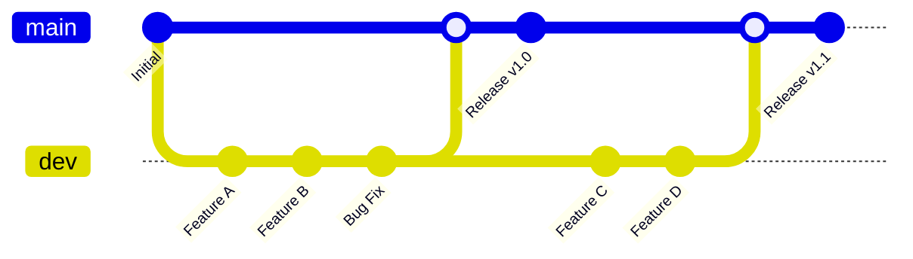
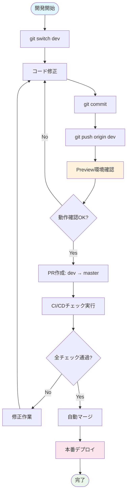
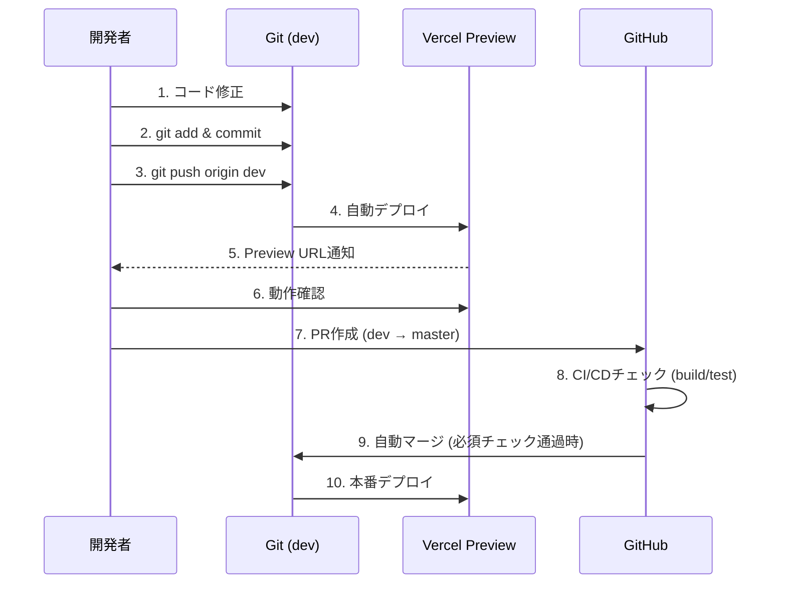

# Suptia 開発フローガイド

## 概要

Suptiaプロジェクトでは、**個人開発に最適化したmaster/dev 2ブランチ体制**による効率的で安全な開発フローを採用しています。シンプルな運用により、迅速な開発と安定したデプロイメントを実現します。

## ブランチ構成



### ブランチの役割

| ブランチ | 用途       | デプロイ先 | 直接Push | 保護ルール |
| -------- | ---------- | ---------- | -------- | ---------- |
| `master` | 本番環境用 | Production | ❌ 禁止  | build/test必須 |
| `dev`    | 開発環境用 | Preview    | ✅ 許可  | なし |

## 開発フロー全体図



## ステップバイステップガイド

### 1. 開発環境のセットアップ

#### 初回セットアップ

```bash
# リポジトリをクローン
git clone https://github.com/your-org/suptia.git
cd suptia

# 依存関係をインストール
npm install

# 環境変数を設定
cp apps/web/.env.local.example apps/web/.env.local
# .env.localファイルを編集して必要な値を設定
```

#### 開発ブランチに切り替え

```bash
# 開発ブランチに切り替え（これだけでOK！）
git switch dev
```

### 2. 日常の開発作業

#### 基本的な開発サイクル



#### 具体的なコマンド例

```bash
# 1. 最新のdevブランチを取得
git pull origin dev

# 2. コードを修正
# (お好みのエディタで作業)

# 3. 変更をステージング
git add .

# 4. コミット（わかりやすいメッセージで）
git commit -m "feat: 新機能Xを追加"

# 5. devブランチにプッシュ
git push origin dev
```

### 3. Preview環境での確認

#### 自動デプロイの流れ

1. **devブランチにpush** → Vercel Preview環境が自動更新
2. **Preview URL取得** → GitHub ActionsまたはVercelダッシュボードで確認
3. **動作確認** → 実際のブラウザで機能をテスト

#### Preview URLの確認方法

```bash
# Preview URLを取得するスクリプト
npm run get-preview-url
```

または、Vercelダッシュボードで確認：

- https://vercel.com/your-team/suptia

### 4. 本番リリース（PR作成）

#### PR作成の手順

1. **GitHub UIでPR作成**
   - Base: `master`
   - Compare: `dev`
   - タイトル: 簡潔で分かりやすく
   - 説明: 変更内容と影響範囲を記載

2. **必須チェックの実行**
   - **build** - アプリケーションのビルド成功 ✅ 必須
   - **test** - 単体テストの実行成功 ✅ 必須

3. **任意チェックの実行**
   - format:check - コードフォーマット確認
   - lint - ESLint静的解析
   - typecheck - TypeScript型チェック
   - headers - セキュリティヘッダー確認
   - jsonld - 構造化データ検証
   - pr-dod-check - Definition of Done確認

4. **自動マージ**
   - **必須チェック通過 → 自動マージ** (承認不要)
   - masterブランチ → 本番環境に自動デプロイ

### 5. 品質チェックの詳細

#### 必須チェック項目（マージブロック対象）

| チェック | 内容 | 実行タイミング | 必須レベル |
| -------- | ---- | -------------- | ---------- |
| **build** | アプリケーションのビルド成功 | 全push | ✅ 必須 |
| **test** | 単体テスト実行 | 全push | ✅ 必須 |

#### 任意チェック項目（情報提供目的）

| チェック     | 内容                     | 実行タイミング | 必須レベル |
| ------------ | ------------------------ | -------------- | ---------- |
| format:check | コードフォーマット       | 全push         | ⚠️ 任意 |
| lint         | ESLintによる静的解析     | 全push         | ⚠️ 任意 |
| typecheck    | TypeScript型チェック     | 全push         | ⚠️ 任意 |
| headers      | セキュリティヘッダー確認 | 全push         | ⚠️ 任意 |
| jsonld       | 構造化データ検証         | 全push         | ⚠️ 任意 |
| pr-dod-check | Definition of Done確認   | PR作成時のみ   | ⚠️ 任意 |

#### ローカルでのチェック実行

```bash
# 必須チェックのみ実行（推奨）
npm run test
npm run build

# 全チェックを一括実行
npm run precommit

# 個別チェック
npm run format:check
npm run lint
npm run test
npm run typecheck
npm run build
npm run headers
npm run jsonld
```

## トラブルシューティング

### よくある問題と解決方法

#### 1. 必須チェック（build/test）が失敗する

**症状**: PRで必須チェックが赤くなり、マージがブロックされる

**解決方法**:

```bash
# 必須チェックをローカルで実行
npm run test   # テストエラーの場合
npm run build  # ビルドエラーの場合

# 修正後、再度push
git add .
git commit -m "fix: test/build errors"
git push origin dev
```

#### 2. 任意チェック（lint/format等）が失敗する

**症状**: PRで任意チェックが赤くなるが、マージは可能

**解決方法**:

```bash
# 自動修正を試す（任意）
npm run lint:fix
npm run format

# 修正する場合
git add .
git commit -m "fix: lint/format errors"
git push origin dev

# または、そのままマージも可能（任意チェックのため）
```

#### 2. Preview環境が更新されない

**症状**: devにpushしてもPreview環境が古いまま

**解決方法**:

1. Vercelダッシュボードでデプロイ状況を確認
2. 環境変数が正しく設定されているか確認
3. ビルドエラーがないか確認

```bash
# 環境変数チェック
npm run env:check

# ローカルビルドテスト
npm run build
```

#### 3. masterブランチに直接pushしようとしてエラー

**症状**: `remote: error: GH006: Protected branch update failed`

**解決方法**:

```bash
# devブランチに切り替え
git switch dev

# 変更をdevにpush
git push origin dev

# その後、GitHub UIでPRを作成
```

#### 4. 環境変数が見つからないエラー

**症状**: `Error: Environment variable XXX is not defined`

**解決方法**:

```bash
# .env.localファイルを確認
cat apps/web/.env.local

# 必要な環境変数を追加
echo "NEXT_PUBLIC_SANITY_PROJECT_ID=your-project-id" >> apps/web/.env.local

# Vercel環境変数も確認・設定
npm run env:sync
```

## 開発のベストプラクティス

### コミットメッセージの書き方

```bash
# 良い例
git commit -m "feat: ユーザー認証機能を追加"
git commit -m "fix: 価格計算のバグを修正"
git commit -m "docs: READMEにセットアップ手順を追加"

# 避けるべき例
git commit -m "update"
git commit -m "fix bug"
git commit -m "WIP"
```

### ブランチの使い方

```bash
# ✅ 推奨: devブランチで直接作業（個人開発最適化）
git switch dev
# 作業...
git push origin dev

# ❌ 非推奨: 不要なfeatureブランチ作成
git switch -c feature/new-feature  # 個人開発では不要
```

### テストの実行

```bash
# 開発中は watch モードで
npm run test:watch

# 必須チェックと同じ条件でテスト
npm run test

# ビルドチェック
npm run build

# カバレッジ確認
npm run test:coverage
```

## 緊急時の対応

### 本番環境で問題が発生した場合

1. **即座にロールバック**

```bash
# ロールバックスクリプト実行
npm run rollback:production
```

2. **問題の調査**

- Vercelダッシュボードでエラーログ確認
- GitHub Actionsでビルドログ確認

3. **修正とデプロイ**

```bash
# devブランチで修正
git switch dev
# 修正作業...
git push origin dev
# PR作成 → 自動デプロイ
```

### 開発環境で問題が発生した場合

```bash
# 依存関係の再インストール
rm -rf node_modules package-lock.json
npm install

# キャッシュクリア
npm run clean

# 環境変数の再確認
npm run env:check
```

## 参考リンク

- [GitHub Repository](https://github.com/your-org/suptia)
- [Vercel Dashboard](https://vercel.com/your-team/suptia)
- [Sanity Studio](https://your-project.sanity.studio)
- [本番サイト](https://suptia.com)

## サポート

質問や問題がある場合は、以下の方法でサポートを受けられます：

1. **GitHub Issues**: バグ報告や機能要求
2. **Slack**: `#development` チャンネル
3. **ドキュメント**: このガイドや他の技術文書

## 新しい運用の特徴

### 個人開発に最適化された変更点

1. **PR承認不要** - 個人開発のため承認プロセスを省略
2. **必須チェック最小化** - build/testのみ必須、他は任意
3. **squash merge強制** - コミット履歴をクリーンに保つ
4. **迅速なデプロイ** - 必要最小限のチェックで高速化

### 品質保証の考え方

- **必須**: build/test（動作保証の最低限）
- **任意**: lint/format等（品質向上のため実行するが、マージはブロックしない）
- **ローカル**: 開発者の判断で品質チェックを実行

---

**重要**: この運用は個人開発に最適化されています。チーム開発に移行する場合は、承認プロセスや追加チェックの導入を検討してください。
